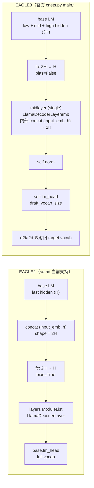

## 问题与范围

EAGLE3 发布后，能否拿官方训练出的 EAGLE3 权重直接喂给本仓库的 `samd/tree_model/eagle2/`（或仅通过配置切换）跑起来？范围：samd 集成的 EAGLE2 接口 vs SafeAILab/EAGLE main 分支（即 EAGLE3）`cnets.py` 的实现差异。

## 速答

**不行，无法直接使用，差距远超"换路径"级别。** 第一刀 `load_state_dict` 即 fail，更深层还有数据流、head 来源、词表映射三处架构级不兼容。需要新增 `samd/tree_model/eagle3/` 子目录并同步改 `samd/model_patch/llama.py` 才能接入。

数据流对比：

## 关键证据

1. **samd 注册表只列三种 tree_method，无 eagle3** — `samd/tree_model/__init__.py:1-13`：`tree_model_cls = {"token_recycle": ..., "eagle": Eagle, "eagle2": Eagle2}`。`samd_config.py:21` 的 `Literal["token_recycle", "eagle", "eagle2"]` 同样限制了入口。**支撑结论：不存在"配置切到 eagle3"的路径。**

2. **`fc` 投影维度不同（致命，加载即 fail）** — samd `samd/tree_model/eagle2/eagle2_model.py:641` 是 `self.fc = nn.Linear(2 * config.hidden_size, config.hidden_size, bias=bias)`，shape `[H, 2H]`；EAGLE3 官方 `cnets.py` 的 `Model.__init__` 是 `self.fc = nn.Linear(config.hidden_size * 3, self.hidden_size, bias=False)`，shape `[H, 3H]` 且无 bias。**支撑结论：strict load_state_dict 会因 `fc.weight` 形状不匹配立即抛错。**

3. **权重加载用 strict load_state_dict，且硬编码 `pytorch_model.bin`** — `samd/tree_model/eagle2/eagle2_model.py:659-666` 的 `load_weight`：`path = os.path.join(path, "pytorch_model.bin"); state_dict = torch.load(path); self.load_state_dict(state_dict)`。EAGLE3 的 state_dict 里还有 samd 模型不认识的键：`midlayer.*`、`lm_head.weight`、`norm.weight`、`d2t`、`t2d`、`midlayer.hidden_norm.weight`，反之 samd 期待的 `layers.0.*`、`fc.bias` 在 EAGLE3 权重中不存在。**支撑结论：键集合 / 形状双重不匹配，无法 strict 加载。**

4. **head 来源根本不同：EAGLE2 共享，EAGLE3 独立 + 缩小词表** — samd `samd/tree_model/eagle2/eagle2.py:23` 直接复用 `self.head = lm.lm_head`，而且 `eagle2_model.py:846` 的 topk_genrate 是 `last_headout = head(last_hidden)`（用调用方传入的 head）。EAGLE3 `cnets.py` 的 `Model.__init__` 里有 `self.lm_head = nn.Linear(config.hidden_size, config.draft_vocab_size, bias=False)`，并在 `topK_genrate` 内部强制走 `last_headout = self.lm_head(self.norm(last_hidden))`，传入的 `head` 参数被忽略。**支撑结论：即使绕过权重加载，head 也指向错误的张量；且 `draft_vocab_size` 不等于 base 模型 `vocab_size`，输出空间错位。**

5. **forward 输入维度假设不同：EAGLE3 需要 3 层 hidden states** — samd 在 `samd_config.py:41` 把 `use_last_hidden_states` 强制设为 True，eagle2.py:57-60 传给 `topk_genrate` 的 `accept_hidden_states` 来自 base 模型的 **最后一层**（维度 H）。EAGLE3 `cnets.py` 的 `forward` 在 `if hidden_states.shape[-1]!=inputs_embeds.shape[-1]: hidden_states=self.fc(hidden_states)` 这一行隐含期望 `hidden_states` 是 `3H`（low + mid + high 三层 hidden state 沿最后维拼接）。**支撑结论：上游数据流也得改 — `samd/model_patch/llama.py` 需要新增 hook 抽指定三层 hidden states 而不是只拿最后一层。**

6. **`LlamaDecoderLayer` 结构与 q/k/v 维度都变了** — samd `eagle2_model.py:510-580` 的 `LlamaDecoderLayer`：多层 `ModuleList`，第 0 层 `if self.index != 0` 条件性跳过 `input_layernorm`，q/k/v 都是 `nn.Linear(hidden_size, ...)` 单倍维度。EAGLE3 `cnets.py` 的 `LlamaDecoderLayeremb` 是**单层**（直接挂在 `self.midlayer`，不在 ModuleList 里），多了 `hidden_norm`，`forward` 签名变为 `(input_emb, hidden_states, ...)`，在层内部 `torch.cat((input_emb, hidden_states), dim=-1)` 后做 attention，因此 `self.q_proj = nn.Linear(self.hidden_size*2, ...)` 输入是 **2H**。**支撑结论：即使强行加载键名匹配的子集，attention 投影也会因为输入维度从 H 变 2H 而错。**

7. **`topK_genrate` 调用约定不同** — samd `eagle2_model.py:820` 返回 `(draft_tokens, {"tree_attn_mask": ..., "tree_position_ids": ..., "tree_retrieve_indices": ...})` 即 `(tensor, dict)`，被 `eagle2.py:62` 用 `pred_ids, buffers_kwargs` 接收。EAGLE3 `cnets.py` 的 `topK_genrate` 返回 `(draft_tokens, retrieve_indices, tree_mask, tree_position_ids)` 即 **4-元组**。**支撑结论：即使前面都解决了，集成层 `Eagle.gen_draft` 也得改解包逻辑。**

8. **EAGLE3 引入 d2t/t2d 词表映射，draft vocab ≠ target vocab** — EAGLE3 `cnets.py` 里 `self.register_buffer("d2t", torch.zeros((config.draft_vocab_size), dtype=torch.long))`、`self.register_buffer("t2d", torch.zeros((config.vocab_size), dtype=torch.bool))`。`topK_genrate` 中：当 `vocab_size != draft_vocab_size` 时，所有 draft 出的 token id 都要走 `topk_index + self.d2t[topk_index]` 才能回到 target vocab。samd 整条链路没有这层映射。**支撑结论：draft token 出来后需要额外映射，否则 SamdModel 上层验证会拿错 token id。**

## 细节展开

**为什么 EAGLE3 要改成多层拼接 + 独立 head（背景）**：根据 EAGLE-3 论文（arXiv:2503.01840），EAGLE3 把训练目标从 "回归 base 模型的 feature" 改为 "直接预测下一个 token"，并发现单用 last layer hidden state 对应的特征空间过窄，于是引入 low/mid/high 三层拼接给 draft 更丰富的语义；同时为了让 draft 训练目标和 base 的 lm_head 解耦，独立训了自己的 `lm_head`，并通过减小 draft 词表（`draft_vocab_size` 一般 ~32k）降低开销，再用 d2t/t2d 在采样和验证时做映射。这些变化是**训练目标驱动的架构变化**，不是 cosmetic 重命名 — 因此权重里包含的张量集合与 EAGLE2 严格不可互换。

**samd 模型 patch 的角度**：EAGLE2 通过 `samd_config.py:38-41` 的 `use_last_hidden_states=True` 路径，让 base model 的 `model_patch/llama.py` 在前向时把 last hidden 暴露出来供 draft 用。要支持 EAGLE3，patch 至少需要：(1) 配置层声明捕获的三个层索引（EAGLE3 训练 config 里通常含 `eagle_layers_to_capture` 之类字段）；(2) patch 在这三层 forward 完成时把 hidden state 缓存；(3) 在 draft 用时把三个张量沿 `dim=-1` concat 成 `3H` 再传入。这是上游数据流改动，不是 draft 模块内部的事。

**为什么 EAGLE3 的 `Eagle2Config` 不能复用**：`samd/tree_model/eagle2/eagle2_config.py` 继承 `PretrainedConfig`，缺少 `draft_vocab_size`、`target_hidden_size`、`eagle_layers_to_capture` 等 EAGLE3 必备字段。即使权重换成 EAGLE3，config 加载阶段（`load_eagle2` 在 `samd_config.py:93-96` 读 `tree_model_path/config.json`）也会因为字段意义错位导致 `Eagle2Model.__init__` 用错维度。

## 未决问题

- EAGLE3 权重发布是否带有训练用的 `eagle_layers_to_capture` 索引（在 EConfig 里）？若有，可作为 model_patch 抽哪几层的依据。
- EAGLE3 是否兼容 GQA（num_key_value_heads ≠ num_heads）的 base 模型？看官方 cnets.py LlamaAttention 同样用 `num_key_value_heads`，应支持，但需要权重对得上。
- SAM-Decoding 的核心机制（按匹配长度切换 SAM draft 和 tree draft）是否对 EAGLE3 仍有同等收益？理论上和 draft 类型无关，但 EAGLE3 本身已经更准，长度切换阈值可能要重调（`samd_config.py:13-14` 的 `len_threshold` / `len_bias`）。

## 后续建议

如果确实要接入 EAGLE3，建议起一个 feature：`cs-feat` 走 design → impl → accept，design 阶段重点画清"新增 `samd/tree_model/eagle3/` 的接口契约 + `model_patch/llama.py` 多层 hook + samd_config 新增分支"这三处。本仓库现有 EAGLE2 路径不要改 — 留作并列选项即可。

## 相关文档

- EAGLE-3 论文：arXiv:2503.01840
- 官方实现：`SafeAILab/EAGLE` GitHub 仓库 main 分支 `eagle/model/cnets.py`
- samd 当前 EAGLE2 集成：`samd/tree_model/eagle2/`、`samd/samd_config.py:38-41`
- 上游数据流：`samd/model_patch/llama.py`、`samd/draft.py:24-79`
