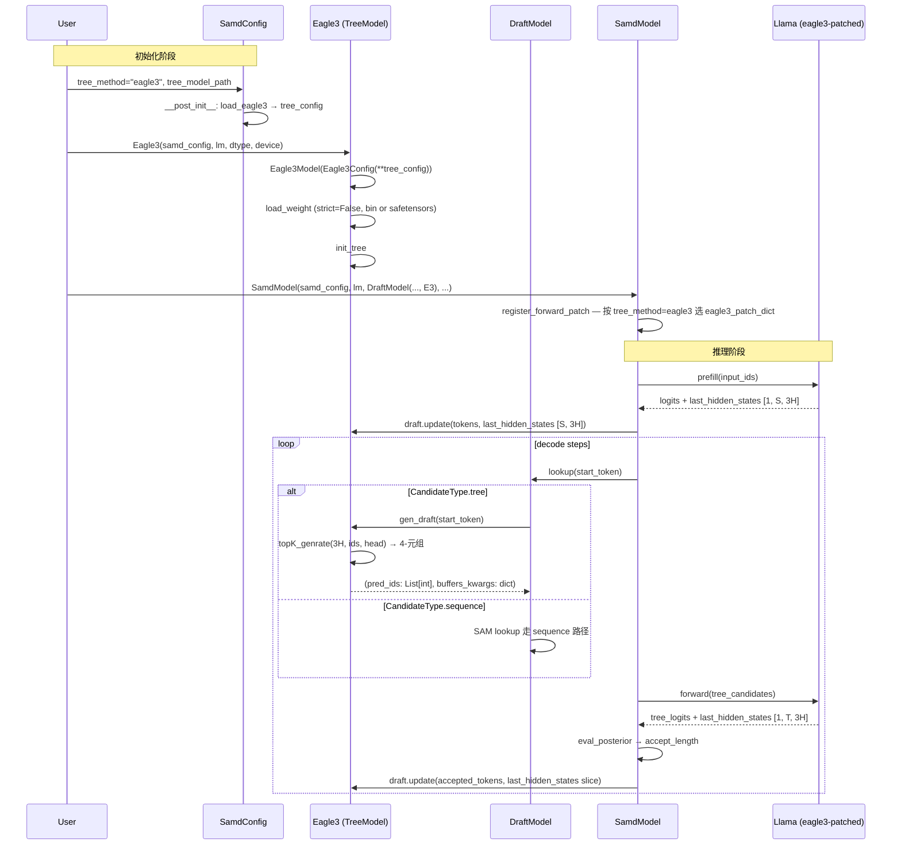

# eagle3-integration design

## 0. 术语约定

| 术语 | 定义 | 防冲突结论 |
|---|---|---|
| EAGLE3 draft model | EAGLE-3 论文（arXiv:2503.01840）训出的轻量推测解码 head，特征 `fc(3H→H)` + 独立 `lm_head` + 缩小 `draft_vocab_size` + `d2t`/`t2d` 映射 | 仓库 grep `eagle3` 仅命中本次 explore；无冲突 |
| target / base model | 被 SAM-Decoding 加速的目标大模型，本 feature 范围限定为 `LlamaForCausalLM` | 沿用现有 `samd_model.py` 命名 |
| 3 层 hidden states | base model 第 `idx ∈ {2, N//2, N-3}` 三层 hidden state，沿 `dim=-1` concat 得到 `[B, S, 3H]` | 新概念 |
| `draft_vocab_size` | EAGLE3 draft 模型自己的词表大小（通常 ~32k），可能 ≤ base vocab_size | 来源 `../EAGLE/eagle/model/cnets.py:Model.__init__` |
| `d2t` / `t2d` | draft-to-target / target-to-draft 词表映射 buffer，`register_buffer` 注册 | 仓库 grep `d2t`/`t2d` 无命中 |
| `tree_method` | `samd_config.SamdConfig.tree_method`，本 feature 新增 `"eagle3"` 选项 | 沿用现有字段 |

## 1. 决策与约束

### 需求摘要

- **做什么**：在 `samd/tree_model/` 下新增 `eagle3/` 子包，扩展 `tree_method` 枚举增加 `"eagle3"`，能加载 EAGLE3 训练的 draft model 权重并跑通 SAM-Decoding 推理流程
- **为谁**：已经训好 EAGLE3 权重的用户，想把它当成新的 draft strategy 接进 SAM-Decoding（与现有 EAGLE2 / Token Recycle 并列可选）
- **成功标准**：
  1. 给定有效 EAGLE3 权重路径 + 兼容 `LlamaForCausalLM` base model，`SamdConfig(tree_method="eagle3", ...)` + `SamdModel(...)` 初始化无错
  2. `samd_model.generate(input_ids, ...)` 输出的 token 序列与 base model greedy 解码逐 token 一致（推测解码本身不改变结果，只加速）
  3. `tree_method ∈ {"token_recycle", "eagle", "eagle2"}` 三条原路径回归测试通过（同输入同输出）
- **明确不做**：
  1. 不修改 `samd/tree_model/eagle2/`、`samd/tree_model/eagle/`、`samd/tree_model/token_recycle/` 任何文件
  2. 不在 `samd_sam_only/` 集成 EAGLE3（该实现不带 draft model，不消费 `tree_method`）
  3. 不支持非 Llama backbone（Qwen2/Qwen3/Mixtral 等 `../EAGLE` 原项目支持但 samd 现状只 patch Llama）
  4. 不实现 EAGLE3 训练代码（只做推理集成）
  5. 不调整 `len_threshold` / `len_bias` 等 SAM 切换阈值
  6. 不引入新的 base model 类（不引 `KVLlamaForCausalLM`，沿用 `LlamaForCausalLM` + monkey patch）

### 复杂度档位

走研究/实验代码默认档位，无偏离 — 已有 `eagle2` 接入模式可对照，扩展路径成熟。

### 关键决策

**D1：base model 多层 hidden state 抽取，硬编码三个 layer index `{2, N//2, N-3}`**

EAGLE3 训练时 `../EAGLE/eagle/model/modeling_llama_kv.py:1137-1139` 用硬编码这三个 index 收集，与推理对齐的唯一安全选择。**被拒方案**：让用户通过 config 传 `eagle_layers_to_capture` —— 索引与权重不匹配会 silent 跑错（输出能产出但精度退化），用户无从感知；且训练侧本就硬编码，对齐它最稳。

**D2：多层 hidden states 暴露方式，沿用现有 `monkey patch LlamaModel.forward` 模式（不用 hook 不用 `output_hidden_states`）**

被拒方案 A（`output_hidden_states=True` + 在 Eagle3 侧取 index）：会让 LlamaModel 把全 N 层 hidden state 全部 allocate 并打包到 `outputs.hidden_states`，每步推理多耗 `(N-3) × seq × H` 显存与拷贝。被拒方案 B（`register_forward_hook` 挂指定 LlamaDecoderLayer）：与 `samd/model_patch/` 既有 monkey patch 模式不一致；hook 生命周期管理（多次 generate 间的 reset）易出错。**采用方案**：新增 `samd/model_patch/llama_eagle3.py`，在 patched `LlamaModel.forward` 内部三个 idx 处把当时的 hidden_states 收集起来，最后沿 `dim=-1` concat 成 `[B, S, 3H]`，作为 `outputs.last_hidden_states` 暴露 —— 与现有 patch 风格完全一致。

**D3：tree_method 路由显式分支，不在 eagle2 路径内嗅探**

新增 `tree_model_cls["eagle3"] = Eagle3` 与 `SamdConfig.__post_init__` 的 `"eagle3"` 分支。**被拒方案**：复用 eagle2 分支按 state_dict key 是否含 `midlayer` 自动嗅探 —— silent 切换风险高，用户难以预测当前走哪条路径，调试痛苦。

**D4：权重加载 `strict=False` + 同时支持 `pytorch_model.bin` 和 `safetensors`**

`../EAGLE/eagle/model/ea_model.py:76` `load_state_dict(..., strict=False)` 是必须的：当 EAGLE3 训练 config 满足 `vocab_size == draft_vocab_size` 时，官方代码会 `del d2t, t2d`（`ea_model.py:74-75`），权重里不存在这两个 buffer key，strict=True 会 missing key 报错。`safetensors` 支持：官方权重发布优先 safetensors（cnets.py 的 load_emb 路径也是 safetensors 优先），EAGLE2 路径写死 `pytorch_model.bin` 不够用。**被拒方案**：strict=True + 要求用户必须有 d2t/t2d —— 与官方权重发布约定冲突。

**D5：`SamdConfig.use_last_hidden_states` 语义保持 bool，由 `tree_method` 决定具体维度**

字段保持 `bool` 类型不变，eagle3 分支同样设为 `True`。具体 hidden state 维度（H vs 3H）由 model_patch 选择决定，对上游 `SamdModel` 透明 —— `prefill` / `decode` 的 `outputs.last_hidden_states` 处理只做 `squeeze(0)` 和 `retrieve_indices` slice，对最后一维 size 无假设。

### 前置依赖

无（implement 阶段才评估）。

## 2. 名词与编排

### 2.1 名词层

#### 现状

- `samd/tree_model/tree.py:TreeModel` — 所有 tree 模型基类，定义 `reset` / `update` / `gen_draft` / `gen_buffers` 接口
- `samd/tree_model/__init__.py:tree_model_cls` — 字典 `{"token_recycle": TokenRecycle, "eagle": Eagle, "eagle2": Eagle2}`
- `samd/tree_model/eagle2/eagle2.py:Eagle2` — 集成类，承担"构造 Eagle2Model + 加载权重 + 接口翻译"
- `samd/tree_model/eagle2/eagle2_model.py:Eagle2Model` — 实际 draft 模型，含 `fc(2H→H)` + 多层 `LlamaDecoderLayer` + `topk_genrate`
- `samd/tree_model/eagle2/eagle2_config.py:Eagle2Config` — 继承 `PretrainedConfig`
- `samd/samd_config.py:SamdConfig.tree_method` — `Literal["token_recycle", "eagle", "eagle2"]`
- `samd/samd_config.py:load_eagle2(tree_model_path)` — 读 `config.json` 返回 `tree_config` dict
- `samd/model_patch/__init__.py:patch_dict` / `attn_patch_dict` — monkey patch 注册表（当前合并所有 backbone patch）
- `samd/model_patch/llama.py:forward` — patched `LlamaForCausalLM.forward`，返回 `SamdCausalLMOutputWithPast(last_hidden_states=outputs[0])`（最后一层 H 维 hidden state）

#### 变化

**新增**（全部位于 `samd/tree_model/eagle3/` 与 `samd/model_patch/`）：

| 文件 | 职责 |
|---|---|
| `samd/tree_model/eagle3/__init__.py` | `from .eagle3 import Eagle3` |
| `samd/tree_model/eagle3/eagle3.py` | `Eagle3(TreeModel)` 集成类，承担接口翻译（cnets 4-元组 → samd 2-元组） |
| `samd/tree_model/eagle3/eagle3_model.py` | `Eagle3Model` — 移植 `../EAGLE/eagle/model/cnets.py:Model`：`fc(3H→H, bias=False)` + 单个 `midlayer = LlamaDecoderLayeremb` + `self.norm` + `self.lm_head(H→draft_vocab_size)` + `d2t`/`t2d` buffer + `topK_genrate` |
| `samd/tree_model/eagle3/eagle3_config.py` | `Eagle3Config(PretrainedConfig)` — 接受 `draft_vocab_size` / `target_hidden_size` 等 EAGLE3 专属字段（通过 `PretrainedConfig` 的 `**kwargs` 机制设为 attr） |
| `samd/tree_model/eagle3/eagle3_utils.py` | 拷贝 cnets.py 的 `LlamaAttention` / `LlamaMLP` / `LlamaRMSNorm` / `LlamaDecoderLayeremb` building blocks — **不复用 eagle2 的同名类**，因为 q/k/v 输入维度从 H 变 2H，结构本质不同 |
| `samd/model_patch/llama_eagle3.py` | EAGLE3 专属 patch：`LlamaForCausalLM.forward` 在 base model forward 内部抓取三层 hidden state concat 成 3H，作为 `outputs.last_hidden_states` 暴露；`LlamaModel._update_causal_mask` 复用 eagle2 同款（tree_mask 注入逻辑不变） |

**修改**（最小化，仅注册表 / 分支扩展）：

| 文件 | 修改 |
|---|---|
| `samd/tree_model/__init__.py` | `tree_model_cls` 字典加 `"eagle3": Eagle3` |
| `samd/samd_config.py` | `tree_method` 的 `Literal[...]` 加 `"eagle3"`；`__post_init__` 加 `elif self.tree_method == "eagle3":` 分支；新增 `load_eagle3(tree_model_path)` 函数 |
| `samd/model_patch/__init__.py` | 导出 `eagle3_patch_dict` / `eagle3_attn_patch_dict`（独立 dict，不合并到 `patch_dict`） |
| `samd/samd_model.py:register_forward_patch` | 按 `self.samd_config.tree_method` 选择 patch_dict —— `"eagle3"` 用 `eagle3_patch_dict`，其他沿用原 `patch_dict` |

#### 接口示例

**`Eagle3.gen_draft`**（与现有 `TreeModel` 协议对齐）：

```python
# 来源：samd/tree_model/eagle3/eagle3.py:Eagle3.gen_draft
def gen_draft(self, start_token: int) -> Tuple[List[int], Dict[str, torch.Tensor]]:
    # self.accept_hidden_states 来自 SamdModel.update_state 喂入，shape = [accept_len, 3H]
    # 内部调 self.model.topK_genrate（4-元组返回）转 samd 2-元组
    draft_tokens, retrieve_indices, tree_mask, tree_position_ids = \
        self.model.topK_genrate(self.accept_hidden_states, self.accpet_tokens, self.head)
    pred_ids = draft_tokens.view(-1).tolist()
    buffers_kwargs = {
        "tree_attn_mask": tree_mask,
        "tree_position_ids": tree_position_ids,
        "tree_retrieve_indices": retrieve_indices,
    }
    return pred_ids, buffers_kwargs
```

**`Eagle3Model.topK_genrate`**（移植自 `../EAGLE/eagle/model/cnets.py:Model.topK_genrate`）：

```python
# 来源：../EAGLE/eagle/model/cnets.py:Model.topK_genrate
def topK_genrate(self, hidden_states, input_ids, head, logits_processor=None) \
    -> Tuple[Tensor, Tensor, Tensor, Tensor]:
    # head 参数为接口兼容保留但函数内部强制用 self.lm_head + self.norm
    # 当 vocab_size != draft_vocab_size 时通过 self.d2t 映射 draft id → target id
    return draft_tokens, retrieve_indices, tree_mask, tree_position_ids
```

**`llama_eagle3.py` patched `LlamaModel` 主体差异**（来源：`../EAGLE/eagle/model/modeling_llama_kv.py:1133-1183`）：

```python
# samd/model_patch/llama_eagle3.py（替换 LlamaModel forward）
all_hidden_states_concat = ()
for idx, decoder_layer in enumerate(self.layers):
    if idx == 2 or idx == len(self.layers) // 2 or idx == len(self.layers) - 3:
        all_hidden_states_concat += (hidden_states,)
    # ... 正常 forward decoder_layer，过 self_attn + mlp
# 最后沿 dim=-1 concat 暴露给 LlamaForCausalLM 包装层
captured_hidden_states_3h = torch.cat(all_hidden_states_concat, dim=-1)  # [B, S, 3H]
```

### 2.2 编排层

#### 主流程图



#### 现状

- `SamdModel.prefill` (`samd/samd_model.py:101-128`)：调 patched `self.lm(...)`，取 `outputs.last_hidden_states`（H 维），传给 `self.draft.update(last_hidden_states=...)`
- `SamdModel.decode` (`samd/samd_model.py:131-182`)：同样取 `outputs.last_hidden_states`（H 维），按 `tree_retrieve_indices` slice 后传 `update`
- `DraftModel.lookup` (`samd/draft.py:52-63`)：按 `tree_method` 自动选用对应 tree_cls；走 tree 路径时调 `self.tree_model.gen_draft`
- `Eagle2.update` (`samd/tree_model/eagle2/eagle2.py:37-50`)：累积 tokens + last_hidden_states，准备给下次 gen_draft
- `LlamaForCausalLM.forward` (`samd/model_patch/llama.py:114-204`)：被 monkey patch，返回 `SamdCausalLMOutputWithPast(last_hidden_states=outputs[0])`（base LlamaModel forward 最后一层 hidden state，shape `[B, S, H]`）
- 拓扑：线性 pipeline + decode 阶段的循环（sequence-or-tree 二分支）

#### 变化

| 位置 | 变化 |
|---|---|
| `SamdModel.prefill` / `decode` | **不改逻辑**。`outputs.last_hidden_states` 的最后维从 H 变 3H 仅对 eagle3 路径生效；后续 `squeeze(0)` / `[retrieve_indices]` / `[best_candidate]` slice 对 dim=-1 无 size 假设，自动适配 |
| `SamdModel.register_forward_patch` | 从单一 `patch_dict` 源改为按 `self.samd_config.tree_method` 分支选择（`"eagle3"` → `eagle3_patch_dict`，其他 → 原 `patch_dict`） |
| `tree_model_cls` 字典 | 新增 `"eagle3": Eagle3` 键 |
| `SamdConfig.__post_init__` | 新增 `"eagle3"` 分支 |
| 拓扑 | 不变（仍是线性 pipeline + sequence-or-tree 二分支） |

#### 流程级约束

- **保留 EAGLE2 / EAGLE / Token Recycle 路径不破坏**：所有改动只通过新增文件 + 字典新增项 + 条件分支实现，不修改 `eagle2/` / `eagle/` / `token_recycle/` 任何一行
- **`last_hidden_states` 维度按 `tree_method` 分支**：eagle / eagle2 仍为 H；eagle3 为 3H。该约束体现在 patch 路径选择，**不在 `SamdModel.prefill` / `decode` 内做条件分支**
- **`strict=False` 加载允许 d2t/t2d 缺失，但其他 missing/unexpected key 必须打印警告**：避免静默兼容错误版本权重
- **不引入新 base model 类**：仍用 `LlamaForCausalLM` + monkey patch，不引 `../EAGLE/eagle/model/modeling_llama_kv.py:KVLlamaForCausalLM`（与现有 samd KV cache 路径耦合，引入会破坏 token_recycle / eagle2 等路径）
- **可观测点**：加载阶段打印 `(missing_keys, unexpected_keys, draft_vocab_size, base_vocab_size, hidden_size, captured_layer_indices)` 一行 — 出问题时第一时间可见

### 2.3 挂载点清单

判据："删了它 feature 是否消失？"

| # | 挂载位置 | 文件 / Key | 动作 |
|---|---|---|---|
| 1 | tree 实现注册表 | `samd/tree_model/__init__.py:tree_model_cls["eagle3"]` | 新增 |
| 2 | 配置层枚举与分支 | `samd/samd_config.py:SamdConfig.tree_method` 的 `Literal` + `__post_init__` 的 `"eagle3"` 分支 | 新增 |
| 3 | model_patch 路由 | `samd/model_patch/__init__.py:eagle3_patch_dict` + `samd/samd_model.py:register_forward_patch` 按 tree_method 选 patch_dict 的逻辑 | 新增（patch_dict 新建 + 选择逻辑修改） |

3 条，符合 3-5 区间。`samd/tree_model/eagle3/` 包整体不是挂载点（内部计算实现），它由挂载点 #1 引用 import。

### 2.4 推进策略

按 paradigm 维度切片，6 步：

1. **新建包骨架 + Config**：建 `samd/tree_model/eagle3/` 目录，先放 `__init__.py`（空导出 stub）、`eagle3_config.py`（拷贝并精简 EConfig）、`eagle3_utils.py`（拷贝 cnets.py 的 LlamaAttention/MLP/RMSNorm/LlamaDecoderLayeremb building blocks）
   - 退出信号：`python -c "from samd.tree_model.eagle3 import Eagle3"` 不报 import 错误（Eagle3 可以是空 stub）

2. **移植 `Eagle3Model`**：按 `../EAGLE/eagle/model/cnets.py:Model` 实现 `__init__` + `forward` + `topK_genrate` + `init_tree` + `load_weight`（支持 `.bin` / `.safetensors` 二选一）
   - 退出信号：用真实 EAGLE3 权重调 `load_weight`，strict=False 返回的 unexpected_keys 为空、missing_keys 至多是 `{d2t, t2d}` 子集；`fc.weight.shape[1] == 3 * hidden_size` 且 `lm_head.weight.shape[0] == draft_vocab_size`

3. **集成类 `Eagle3`**：实现 `Eagle3(TreeModel)` 的 `reset` / `update` / `gen_draft` / `gen_buffers`；重点处理 cnets `topK_genrate` 4-元组 → samd 2-元组（pred_ids list + buffers dict）翻译
   - 退出信号：单独构造 `Eagle3` + mock `accept_hidden_states`（3H 维）+ 调 `gen_draft(start_token)` 能产出 `(List[int], dict)`，dict 含 `tree_attn_mask` / `tree_position_ids` / `tree_retrieve_indices` 三个键

4. **base model 多层 patch**：实现 `samd/model_patch/llama_eagle3.py`，patched `LlamaModel.forward` 在 idx ∈ {2, N//2, N-3} 三个位置抓 hidden state 并 concat
   - 退出信号：用最小 Llama 实例（如 `LlamaConfig(num_hidden_layers=8)`）+ patched forward，单步 forward 后 `outputs.last_hidden_states.shape[-1] == 3 * hidden_size`

5. **接通注册与选择**：修改 `tree_model/__init__.py`、`samd_config.py`（加 Literal 项、`__post_init__` 分支、`load_eagle3`）、`model_patch/__init__.py`（导出 `eagle3_patch_dict`）、`samd_model.py:register_forward_patch`（按 tree_method 选 patch_dict）
   - 退出信号：`SamdConfig(tree_method="eagle3", tree_model_path=PATH)` 构造成功；`SamdModel(...)` 初始化时打印的 patch setattr 日志显示走 eagle3 路径

6. **端到端验证**：参照 `tests/test_samd.py` 模式，写 EAGLE3 路径用例（真实权重 + 兼容 Llama base），与 base model `generate(do_sample=False)` 逐 token 对比；再回归跑 eagle / eagle2 / token_recycle 三条原路径
   - 退出信号：(a) eagle3 路径生成 50 个 token 与 base greedy 逐 token 一致；(b) 其他三条路径与改动前输出 byte-equal；(c) `git diff samd/tree_model/eagle2/ samd/tree_model/eagle/ samd/tree_model/token_recycle/ samd_sam_only/` 为空

### 2.5 结构健康度与微重构

##### 评估前

`python .codestable/tools/search-yaml.py --dir .codestable/compound --filter doc_type=decision --filter category=convention --query "目录组织 OR 命名 OR 归属"` — `compound/` 当前仅一份 explore（doc_type=explore），无任何 decision/convention 命中，跳过套用。

##### 评估

- **文件级（要改的现有文件）**：
  - `samd/tree_model/__init__.py`（13 行；新增 1 行 dict 条目）— 极简健康
  - `samd/samd_config.py`（97 行；新增 1 个 `elif` 分支 ~4 行 + 1 个 `load_eagle3` 函数 ~4 行；`Literal` 新增 1 项）— 现有规模与改动量都很小，无压力
  - `samd/model_patch/__init__.py`（8 行；新增 1 行 import + 1 行导出）— 极简健康
  - `samd/samd_model.py`（323 行；仅改 `register_forward_patch` 方法 ~5 行加 if-else）— 单方法局部改动，无压力
- **目录级（新文件落进的目录）**：
  - `samd/tree_model/`（现有 6 项：4 子目录 + `__init__.py` + `tree.py`；本次加 1 个 `eagle3/` 子目录 → 7 项）— 未达 ≥8 摊平阈值；命名模式与现有"按 tree_method 分子包"约定一致 — 健康
  - `samd/model_patch/`（现有 2 项：`__init__.py` + `llama.py`；本次加 1 个 `llama_eagle3.py` → 3 项）— 极少；命名模式"按 backbone × tree_method 组合"自然延展 — 健康

##### 结论：不做微重构

所有要改的现有文件本就是"注册表 / 配置分支 / patch 选择"职责，新增 1-5 行/条目是其自然扩展；新文件落进的子目录与现有约定（每 tree_method 一独立子包；每 backbone-patch 组合一独立 patch 文件）完全一致，结构无需调整。

##### 超出范围的观察

- `samd/model_patch/llama.py:forward`（114-204 行）当前耦合了"返回带 last_hidden_states 的 ModelOutput"+"logits 计算"+"标准 LlamaForCausalLM forward 全流程"。未来若有更多 tree_method 各自要不同的 hidden state 抽取策略，按 backbone × tree_method 维度继续平铺 patch 文件可能不可持续，可考虑抽出 "hidden_state extraction strategy" 接口。本 feature 不做，建议未来走 `cs-refactor` 处理。
- `.codestable/architecture/ARCHITECTURE.md` 当前是 onboard 留下的空骨架（只填了项目简介）。本 feature acceptance 阶段是首次实际产出可归并到架构的内容，建议同步触发 `cs-arch backfill` 补出 samd / samd_sam_only / evaluation 三大子系统现状。本 feature 不强制做，建议 acceptance 阶段评估。

## 3. 验收契约

### 关键场景清单

**正常路径**：

- **场景 1（初始化）**：给定有效 EAGLE3 权重路径 + 兼容 Llama base model，`SamdConfig(tree_method="eagle3", tree_model_path=PATH)` + `SamdModel(...)` 完成构造，无 exception。可观察：`samd_model.draft.tree_model.__class__.__name__ == "Eagle3"`，`samd_model.draft.tree_model.model.fc.weight.shape == (hidden_size, 3 * hidden_size)`，`samd_model.draft.tree_model.model.lm_head.weight.shape == (draft_vocab_size, hidden_size)`
- **场景 2（推理对齐）**：调 `samd_model.generate(input_ids, ...)` 生成 ≥ 50 个 token，无 shape / key error；与 `base_model.generate(input_ids, do_sample=False, ...)` 逐 token 对比完全一致
- **场景 3（无 d2t 简化模式）**：EAGLE3 权重的 `vocab_size == draft_vocab_size` 时（官方代码会 `del d2t, t2d`），权重 missing keys 仅含 `d2t` / `t2d` 子集，加载完成且推理通过

**关键边界**：

- **场景 4（权重类型错位）**：`tree_method="eagle3"` 但 `tree_model_path` 指向 EAGLE2 权重 → 必须报清晰错误（如 `fc.weight shape mismatch: expected (H, 3H), got (H, 2H)`），不允许 silent succeed
- **场景 5（路径不存在）**：`tree_model_path` 不存在 → 报 `FileNotFoundError` 带具体路径
- **场景 6（拼写错误）**：`tree_method` 拼写错误（如 `"eagle_3"` / `"EAGLE3"`） → `SamdConfig.__post_init__` 阶段就 raise（不要等到 `DraftModel.__init__` 才 KeyError）

**关键错误路径**：

- **场景 7（unexpected key 告警）**：strict=False 加载若返回非空 `unexpected_keys`（即权重含 `Eagle3Model` 不认识的字段，可能版本不匹配）→ 必须打印警告含 key 列表，提示用户检查权重版本

**回归（保留原路径）**：

- **场景 8（EAGLE2 回归）**：相同测试脚本 `tree_method="eagle2"` 路径，输出 token 序列与本 feature 引入前完全一致
- **场景 9（其他路径回归）**：`tree_method ∈ {"token_recycle", "eagle"}` 同样回归通过

### 明确不做的反向核对项

- **R1**：`grep -rE "modeling_qwen|modeling_mixtral|KVQwen|KVMixtral" samd/tree_model/eagle3/` 应为空（不支持非 Llama backbone）
- **R2**：`git diff samd/tree_model/eagle2/ samd/tree_model/eagle/ samd/tree_model/token_recycle/` 应为空（不改现有 tree 实现）
- **R3**：`git diff samd_sam_only/` 应为空（samd_sam_only 不参与）
- **R4**：`grep -rE "len_threshold|len_bias" samd/tree_model/eagle3/` 应为空（不调切换阈值）
- **R5**：`grep -rE "\\bloss\\b|optimizer|SmoothL1|criterion|\\.backward\\(" samd/tree_model/eagle3/` 应为空（不引训练代码）
- **R6**：`grep -r "KVLlamaForCausalLM" samd/` 应为空（不引入新 base model 类）

## 4. 与项目级架构文档的关系

**预判 acceptance 阶段要提炼回 architecture 的**：

- **名词** → `architecture/ARCHITECTURE.md:3. 子系统索引` 新增 `samd/tree_model/eagle3/` 包描述（"对接 EAGLE-3 训练权重的 draft model 集成层，与 eagle2/ 并列独立切换"）
- **动词骨架** → 建议 acceptance 阶段同步起一份 `architecture/samd-draft-strategies.md`（type 段 `samd`），统一记录当前 4 种 tree_method（token_recycle / eagle / eagle2 / eagle3）的切换协议（`DraftModel.lookup` → `tree_model.gen_draft` → `buffers_kwargs` 协议）与对应 hidden_state 维度约定（H vs 3H）
- **流程级约束** → `ARCHITECTURE.md:5. 已知约束 / 硬边界` 新增："`tree_method='eagle3'` 时 base model 必须装上 `eagle3_patch_dict`，否则 last_hidden_states 不会包含三层拼接信息，draft 推理会 silent 跑错（精度退化但不报错）"

**关联已有架构 doc**：当前 `architecture/` 只有 `ARCHITECTURE.md` 骨架（仅含项目简介）。本 feature 是 CodeStable 接入后首个产出实际架构内容的 feature。

**架构总入口新增描述**：建议 acceptance 阶段把 ARCHITECTURE.md 第 2、3、5 节充实起来（不是贴 design 链接），并在第 3 节"子系统索引"加一句概括"samd 通过 `samd_config.tree_method` 支持 4 种 draft 策略，各策略实现在 `samd/tree_model/<method>/`，对应 base model patch 在 `samd/model_patch/`"。具体动作交给 acceptance 后的 `cs-arch backfill`。
