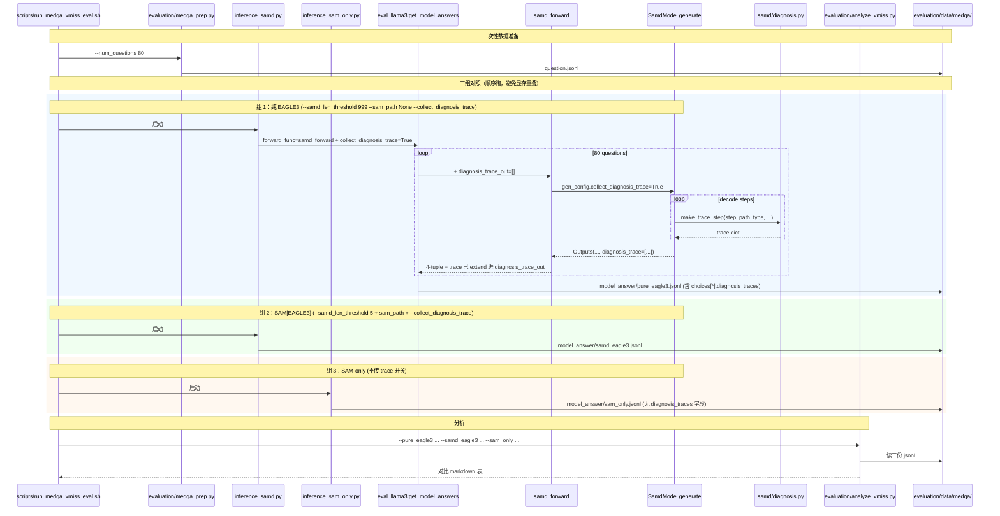

# medqa-vmiss-eval design

## 0. 术语约定

| 术语 | 定义 | 防冲突结论 |
|---|---|---|
| V_miss / verifier-miss | 推测解码 verifier 在某个 step 拒收 draft、且 verifier 选择的"正确"下一 token 不在 draft 模型词表内（`t2d[token_id] == False`）的 step 占比。衡量 draft 词表覆盖盲点 | 新概念；仓库 grep `V_miss/vmiss` 仅命中本 feature；与 EAGLE 原版 `verifier_target_reachable` 一致 |
| diagnosis trace | 一次 generate 调用的 per-step 诊断记录列表，每条 step 含 `path_type / accept_length / first_rejected_* / verifier_target_*` 字段 | 新概念；samd 仓库 grep 无命中 |
| `path_type` | trace step 标识本步走哪条 draft 路径，取值 `"sequence"`（SAM 序列匹配）/ `"tree"`（draft 模型树）。直接对齐 `samd/draft.py:CandidateType.value` | 沿用 samd 现有 enum |
| verifier_target | 在第一个被拒位置上，verifier (即 base model) 给出的 argmax token id（greedy 模式下唯一确定） | 来源 `../EAGLE/eagle/model/ea_model.py:131` |
| verifier_target_reachable | `Eagle3Model.t2d[verifier_target]` 的布尔值；表示 verifier 期望的 token 是否在 draft 词表内可索引 | 来源 `../EAGLE/eagle/model/ea_model.py:135` |
| `t2d` buffer | EAGLE3 draft 模型注册在 `Eagle3Model:74-76` 的 target-to-draft 词表覆盖位图，`bool [base_vocab_size]` | 沿用上一个 feature 引入 |
| 三组对照 | (a) 纯 EAGLE3：tree_method=eagle3 + 关 SAM 切换；(b) SAM-only：`samd_sam_only/` 包路径无 draft；(c) SAM[EAGLE3]：tree_method=eagle3 + SAM 切换默认阈值 | 新概念；与现有 inference 入口一一对应 |
| MedQA | HuggingFace `bigbio/med_qa` 数据集 en split（USMLE-style 5-choice MCQ），本 feature 首批截取 80 题，落 `evaluation/data/medqa/question.jsonl` 跑加速比评测 | 新概念；spec_bench 路径模板可复用 |

## 1. 决策与约束

### 需求摘要

- **做什么**：在 samd 评测主循环加 V_miss 诊断 trace 收集（开关默认 off），准备 MedQA 80 题数据集，跑三组对照（纯 EAGLE3 / SAM-only / SAM[EAGLE3]），产出 per-step trace 并跑分析脚本算出 accept_length 平均 + tree-step V_miss rate 的对比表
- **为谁**：研究 SAM[EAGLE3] 在垂直医学领域加速优势的论文实验需求 —— 用 MedQA 揭示 draft model 词表盲点（V_miss）与 SAM 切换补偿之间的关系
- **成功标准**：
  1. trace 开关 off 时，`scripts/test_samd_eagle3.sh` 单 prompt 输出与本 feature 引入前 byte-equal（推理路径零变化）
  2. 三组对照在 MedQA 80 题上各跑通一次，answer_file 含完整 per-step diagnosis_trace 字段
  3. `evaluation/analyze_vmiss.py` 读三组 answer_file 输出对比 markdown 表，包含每组 `mean_accept_length` 及 EAGLE3 两组的 `tree_step_vmiss_rate`（SAM-only 该字段为 N/A）
  4. 纯 EAGLE3 组（`--samd_len_threshold 999`）trace 内 `path_type` 全部为 `"tree"`；SAM[EAGLE3] 组 trace 内同时存在 `"tree"` 和 `"sequence"` step
- **明确不做**：
  1. 不修改 samd 主推理 forward 流程的功能行为（trace 是旁路观察，不改输出）
  2. 不修改 `samd_sam_only/`（SAM-only 组只测 accept_length，不收集 V_miss trace）
  3. 不修改其他 tree_method（eagle / eagle2 / token_recycle）的 trace 字段语义；trace 启用时 verifier_target_reachable 字段对非 eagle3 path 自动为 `None`
  4. 不新建 `evaluation/inference_eagle3.py`（纯 EAGLE3 通过 `inference_samd.py --samd_len_threshold 999 --sam_path None` 实现，仅参数差异）
  5. 不修改 `evaluation/eval_vicuna.py`（本 feature 走 llama3 path）
  6. 不修改任何 `samd/tree_model/` / `samd/model_patch/` 文件（不动 draft model 与 base patch）
  7. 不实现 V_miss 之外的 draft 诊断维度（如 sibling rank、accepted 链路逆推等）—— 这些 ../EAGLE 原版有但本 feature 不引
  8. 不在本 feature 跑超 80 题规模（先小规模跑通流程，扩规模另起 feature）
  9. 不评估答题准确率（评测目标是加速比 + 词表覆盖，不是医学问答正确率）

### 复杂度档位

走研究 / 实验代码默认档位，无偏离。本 feature 是上一个 feature `2026-05-23-eagle3-integration` 的延伸分析层，挂在已有评测路径上。

### 关键决策

**D1：trace 开关挂 `SamdGenerationConfig` 而非 `SamdConfig`**

trace 是 *per-generation* 行为决定（同一个 SamdModel 实例既能跑普通推理也能跑诊断推理），不属于模型构造级常量。`SamdGenerationConfig` 在 `samd/utils.py:31-48` 已经承担 `max_new_tokens / temperature / greedy` 等运行级控制，扩 `collect_diagnosis_trace: bool = False` 是同语义层的自然新增。**被拒方案**：挂 `SamdConfig` —— 会让"想换个 prompt 跑诊断"需要重建整个 SamdModel，多此一举。

**D2：trace 数据通过 `Outputs` namedtuple 新字段 + `samd_forward` kwarg 透传，不走 side channel**

`samd/samd_model.py:Outputs` 当前是 4 字段 namedtuple，加第 5 个 `diagnosis_trace: Optional[List[Dict]] = None`（用 `defaults` 兜底确保向后兼容）。`samd_forward` 多接一个 `diagnosis_trace_out: Optional[list] = None` kwarg，generate 完成后把 `outputs.diagnosis_trace` 追加进这个 list（如有）。`eval_llama3.py:get_model_answers` 按 trace 开关在 turn 循环里创建空 list 注入，拿回 trace 后写入 `ans_json["choices"][i]["diagnosis_trace"]`。

**被拒方案 A（forward_func 改 5 元组返回）**：会破坏现有 `output_ids, new_token, step, accept_length_tree = forward_func(...)` 解包写法，需要修改所有 6 个 `inference_*.py` 入口。**被拒方案 B（`SamdModel._last_diagnosis_trace` 实例属性）**：side channel 模式难以多次 generate 间清理，且与 `Outputs` 现有"一次 generate 一份输出"风格冲突。

**D3：V_miss 只在 tree-path step 上有意义，sequence-path step 的 reachable 字段保留为 `None`**

SAM 序列路径 (`CandidateType.sequence`) 产出的 draft 来自 prompt suffix 匹配，与 draft 模型词表无关系；`verifier_target_reachable` 概念不适用。但 trace 仍记录 `path_type="sequence"` + `accept_length`，便于分析脚本区分两条路径对加速度的贡献占比。**对照表**：

| path_type | step_idx | accept_length | first_rejected_token_id | first_rejected_reachable | verifier_target_token_id | verifier_target_reachable |
|---|---|---|---|---|---|---|
| `"tree"` (eagle3) | filled | filled | filled or None | bool or None | filled or None | bool or None |
| `"tree"` (eagle/eagle2/token_recycle) | filled | filled | filled or None | None（无 t2d buffer） | filled or None | None |
| `"sequence"` | filled | filled | None | None | None | None |

**D4：纯 EAGLE3 对照组用 `inference_samd.py --samd_len_threshold 999 --sam_path None`，不新增 inference_eagle3.py 入口**

`samd/draft.py:DraftModel.lookup:56` 用 `max(match_dyn, match_static) >= self.len_threshold` 切换 SAM 路径；把 `len_threshold` 设到远大于 prompt 长度（999）后所有 step 必走 tree path。`--sam_path None` 进一步关掉 StaticSAM。两个参数合起来在仓库现有路径上实现"纯 EAGLE3"语义。**被拒方案**：新增 `inference_eagle3.py` —— 入口骨架与 `inference_samd.py` 几乎完全重复（仅 SAM 阈值差异），按 cs-feat-design "别替用户做决定" 纪律也已经经用户确认采用本方案。

**D5：trace 字段集照搬 EAGLE 原版 `_make_diagnosis_trace_step` 的 V_miss 关键子集，不引 sibling rank 等扩展维度**

`../EAGLE/eagle/model/ea_model.py:102-181` 的 trace step 含 16 个字段，本 feature 只保留 V_miss 计算必需的 7 个：`step_idx / path_type / accept_length / first_rejected_token_id / first_rejected_reachable / verifier_target_token_id / verifier_target_reachable`。`accepted_token_ids` / `accepted_reachable` / `sibling_rank` 等先不引（按 cs-feat-design "宁可漏判，别误判"，等到分析时确实需要再扩 trace 协议）。

**D6：MedQA 数据准备走 HuggingFace `bigbio/med_qa` 的 en split test split，prompt 模板照 USMLE 答题惯例**

bigbio/med_qa 的 en split 是美式 USMLE 医师考试 5 选 MCQ，每题字段 `question / options (list)`。prompt 拼装：

```
{question}

A. {options[0]}
B. {options[1]}
C. {options[2]}
D. {options[3]}
E. {options[4]}

Answer:
```

落 `evaluation/data/medqa/question.jsonl` 每行格式：`{"question_id": int, "category": "medqa", "turns": [<上述拼好的字符串>]}`。**被拒方案**：用 raw question + options 不拼模板 —— 模型容易答非所问；评测加速度时希望 token 序列稳定可预测，模板化能保证 generate 路径相似。

**D7：本 feature 先跑 80 题，扩规模交后续 feature**

80 题与 `spec_bench` / `mt_bench` 同规模，跑一组约 30 分钟，三组共 ~1.5 小时；够论证流程跑通、V_miss 趋势能看出。规模扩到 200 / 全量 (1273) 另起 feature/issue（用户已确认）。

### 前置依赖

- 上一个 feature `2026-05-23-eagle3-integration` 已合入：`Eagle3.model.t2d` buffer 已注册、`SamdConfig(tree_method="eagle3")` 可用、`samd_forward` / `inference_samd.py` 已支持 eagle3 路径
- 需新增 Python 依赖：`datasets`（用于 `bigbio/med_qa` 下载）。如未装，`evaluation/medqa_prep.py` 启动时检查并给出 `pip install datasets` 提示

## 2. 名词与编排

### 2.1 名词层

#### 现状

- `samd/utils.py:31-48 SamdGenerationConfig` — 运行级配置 dataclass：`max_steps / max_new_tokens / max_cache_len / greedy / temperature / top_p / top_k / logits_processor`
- `samd/samd_model.py:23 Outputs` — namedtuple，4 字段 `(output_ids, decode_tokens, decode_steps, accepet_length_per_step)`
- `samd/samd_model.py:236-280 SamdModel.generate` — prefill + 循环 decode；每步通过 `decode → eval_posterior → update_state` 流程更新；最终返回 `Outputs(...)`
- `samd/samd_model.py:137-188 SamdModel.decode` — `gen_candidates → forward → eval_posterior → update_state`；其中 `eval_posterior` 在 `samd/utils.py:107-141` 返回 `(best_candidate, accept_length, sample_p)`
- `samd/draft.py:16-20 CandidateType / Candidates` — enum `sequence / tree` 与 namedtuple `(type, tokens, candidate_tokens, buffers_kwargs)`
- `samd/tree_model/eagle3/eagle3_model.py:74-76 Eagle3Model.t2d` — `register_buffer("t2d", bool [base_vocab_size])`
- `samd/tree_model/eagle3/eagle3.py:12-95 Eagle3` — 集成类，`self.model.t2d` 可访问；`Eagle3Model` 持有
- `evaluation/inference_samd.py:13-36 samd_forward` — `forward_func` 实现，签名 `(inputs, model, tokenizer, max_new_tokens, temperature, do_sample)`，调 `model.generate(...)` 返回 4 元组
- `evaluation/eval_llama3.py:71-276 get_model_answers` — 主循环；turn 维度调 `forward_func`，把 `output_ids / new_token / step / accept_length_tree` 写入 `choices[i]` 的 `turns / decoding_steps / new_tokens / wall_time / accept_lengths` 字段
- `evaluation/inference_sam_only.py:12-33 sam_only_forward` — 用 `samd_sam_only/` 包，不消费 tree_method
- `evaluation/data/spec_bench/question.jsonl` — Spec-Bench 格式样板，每行 `{question_id, category, turns}`

#### 变化

新增：

| 文件 | 职责 |
|---|---|
| `samd/diagnosis.py` | trace step 构造工具：`make_trace_step(step_idx, path_type, accept_length, candidates, tree_logits, t2d_buffer) -> Dict`；`_token_reachable(token_id, t2d) -> Optional[bool]` |
| `evaluation/medqa_prep.py` | HuggingFace `bigbio/med_qa` en split test → `evaluation/data/medqa/question.jsonl` 转换脚本；CLI 接 `--num_questions 80` |
| `evaluation/analyze_vmiss.py` | 读三组 answer_file 输出对比 markdown 表；CLI 接 `--pure_eagle3 <file> --samd_eagle3 <file> --sam_only <file>` |
| `scripts/run_medqa_vmiss_eval.sh` | 跑批入口：data prep → 三组 inference → analyze 一条命令搞定 |

修改（最小化，仅在必要挂载点注入）：

| 文件 | 修改 |
|---|---|
| `samd/utils.py:SamdGenerationConfig` | 加 `collect_diagnosis_trace: bool = field(default=False)` |
| `samd/samd_model.py` | (a) `Outputs` namedtuple 加第 5 字段 `diagnosis_trace`，用 `defaults=[None]`；(b) `SamdModel.generate` 维护 `diagnosis_trace: List[Dict]` 累积器；(c) `SamdModel.decode` 返回值扩展为 `(sample_p, new_tokens, trace_meta)`，trace_meta 含 `path_type / candidates / tree_logits / best_candidate / accept_length` 等收集所需信息；(d) `generate` 按 `gen_config.collect_diagnosis_trace` 判定是否调 `make_trace_step` 收集 |
| `evaluation/inference_samd.py:samd_forward` | 签名加 `diagnosis_trace_out: Optional[list] = None` kwarg；构造 `SamdGenerationConfig` 时 `collect_diagnosis_trace=(diagnosis_trace_out is not None)`；generate 返回后若 `diagnosis_trace_out is not None`，`diagnosis_trace_out.extend(outputs.diagnosis_trace or [])`；另加 `max_cache_len: Optional[int] = None` kwarg（None 时 fallback 到 `model.lm.config.max_position_embeddings` 保留旧行为） |
| `evaluation/inference_samd.py` | CLI 新增 `--collect_diagnosis_trace` flag + `--max_cache_len` int (default None)；`run_evals[args.template](..., collect_diagnosis_trace=..., max_cache_len=...)` 透传到 kwargs |
| `evaluation/inference_sam_only.py:sam_only_forward` | 签名加 `max_cache_len: Optional[int] = None` kwarg（同 samd_forward 语义）；CLI 加 `--max_cache_len`；run_evals 透传 |
| `evaluation/eval_llama3.py:get_model_answers` | 接 `collect_diagnosis_trace: bool = False` kwarg；turn 循环里按开关创建 `diagnosis_trace_out = []`，传给 forward_func；turn 完成后挂到 `cur_diagnosis_traces.append(diagnosis_trace_out)`；choice 字典加 `diagnosis_traces` 字段（list of turn-level traces，与 `turns` 长度对齐） |
| `evaluation/data/medqa/question.jsonl` | 新增数据文件（80 行 jsonl），由 `medqa_prep.py` 生成 |

#### 注：max_cache_len CLI 补丁说明

上一个 feature `2026-05-23-eagle3-integration` 的盲区：`inference_samd.py:samd_forward` 和 `inference_sam_only.py:sam_only_forward` 默认把 `max_cache_len` 设为 `model.lm.config.max_position_embeddings`。Llama-3.1 (131072) 上 `SamdStaticCache.__init__` 会 alloc ~16 GiB KV cache，24 GiB GPU 必 OOM。`tests/test_samd.py` 走 CLI `--max_cache_len` 默认 2048 没事，所以上次 acceptance 在 `test_samd_eagle3.sh` 路径上跑通了但在 inference 入口上未实测。本 feature smoke / 三组对照都跑 inference_samd.py / inference_sam_only.py，撞到这个盲区。修法是统一这两个 forward 接 `max_cache_len` kwarg + CLI flag，默认值仍为 `model.lm.config.max_position_embeddings`（不破坏 Vicuna / Llama-3 旧用户），脚本侧显式传 `--max_cache_len 4096`。属于 design 没覆盖的角落、与本 feature 主线（trace 协议）同文件耦合发生，故在本 feature 内顺势修复，回填此说明。

#### 接口示例

`samd/diagnosis.py:make_trace_step`：

```python
# 来源：本 feature；语义对齐 ../EAGLE/eagle/model/ea_model.py:_make_diagnosis_trace_step (102-181)
from typing import Dict, Any, Optional
import torch

def make_trace_step(
    step_idx: int,
    path_type: str,                          # "sequence" or "tree"
    accept_length: int,                      # samd 口径下含 +1 base token
    best_candidate: Optional[int] = None,    # tree path 才有
    candidates: Optional[torch.Tensor] = None,    # [num_paths, max_depth+1]，tree path 才有
    tree_logits: Optional[torch.Tensor] = None,   # [num_paths, max_depth, V]，tree path 才有
    t2d_buffer: Optional[torch.Tensor] = None,    # bool [base_vocab_size]，eagle3 才有
) -> Dict[str, Any]:
    """Build a per-step trace entry. Sequence-path or non-eagle3 tree-path
    callers omit the optional args; reachable fields default to None.

    Returns dict with 7 keys:
        step_idx, path_type, accept_length,
        first_rejected_token_id, first_rejected_reachable,
        verifier_target_token_id, verifier_target_reachable
    """
```

`samd_forward` 调用样例（trace 收集模式）：

```python
# evaluation/inference_samd.py:samd_forward
def samd_forward(inputs, model, tokenizer, max_new_tokens,
                 temperature=0.0, do_sample=False,
                 diagnosis_trace_out: Optional[list] = None):
    outputs = model.generate(
        inputs.input_ids,
        generation_config=SamdGenerationConfig(
            max_new_tokens=max_new_tokens,
            max_cache_len=model.lm.config.max_position_embeddings,
            greedy=not do_sample,
            temperature=temperature,
            collect_diagnosis_trace=(diagnosis_trace_out is not None),
        ),
    )
    if diagnosis_trace_out is not None and outputs.diagnosis_trace is not None:
        diagnosis_trace_out.extend(outputs.diagnosis_trace)
    return (outputs.output_ids, outputs.decode_tokens,
            outputs.decode_steps, outputs.accepet_length_per_step)
```

`eval_llama3.get_model_answers` 写入 trace 的关键片段：

```python
# evaluation/eval_llama3.py:get_model_answers
collect_diagnosis_trace = kwargs.pop("collect_diagnosis_trace", False)
...
for j in range(len(question["turns"])):
    ...
    diagnosis_trace_out = [] if collect_diagnosis_trace else None
    output_ids, new_token, step, accept_length_tree = forward_func(
        inputs, model, tokenizer, max_new_tokens,
        diagnosis_trace_out=diagnosis_trace_out,
        **kwargs,
    )
    ...
    if collect_diagnosis_trace:
        cur_diagnosis_traces.append(diagnosis_trace_out)

choices.append({
    "index": i, "turns": turns, "decoding_steps": steps,
    "new_tokens": new_tokens, "wall_time": wall_time,
    "accept_lengths": cur_accept_lengths_tree,
    **({"diagnosis_traces": cur_diagnosis_traces} if collect_diagnosis_trace else {}),
})
```

`evaluation/analyze_vmiss.py` 输出示例（markdown 表）：

```markdown
| group | mean_accept_length | tree_steps | tree_step_vmiss_rate |
|---|---|---|---|
| pure_eagle3   | 2.31 | 213 | 18.3% |
| samd_eagle3   | 3.45 | 142 | 22.5% |
| sam_only      | 2.87 | N/A | N/A   |
```

### 2.2 编排层

#### 主流程图



#### 现状

- `SamdModel.generate` 主循环 `samd/samd_model.py:259-279`：固定 5 个统计量（`decode_tokens / decode_steps / accepet_length_per_step` 在循环里累积），最后 `return Outputs(...)`
- `SamdModel.decode` `samd/samd_model.py:137-188`：返回 `(sample_p, new_tokens)`；中间拿到 `candidates / best_candidate / accept_length / tree_logits / candidate_tokens`，但目前没暴露给 generate
- `samd_forward` `evaluation/inference_samd.py:13-36`：把 `outputs` 4 个字段映射到 forward_func 4 元组
- `eval_llama3.get_model_answers` `evaluation/eval_llama3.py:71-276`：双层循环（per question × per turn），输出 ans_json 含 `choices[i]` 的 5 个 statistics 字段
- 拓扑：线性 pipeline（prep → 3 组 sequential inference → analyze），每组内部 question/turn 二层循环

#### 变化

| 位置 | 变化 |
|---|---|
| `SamdGenerationConfig` | 加 `collect_diagnosis_trace: bool = False` 字段 |
| `SamdModel.generate` | (a) 主循环前初始化 `self._step_trace: List[Dict] = [] if gen_config.collect_diagnosis_trace else None`；(b) decode 调用扩展为接收 trace_meta；(c) generate 末尾把累积 trace 注入 `Outputs(diagnosis_trace=self._step_trace)` |
| `SamdModel.decode` | 返回值从 `(sample_p, new_tokens)` 扩为 `(sample_p, new_tokens, trace_meta)`；trace_meta 含 `path_type / best_candidate / accept_length / candidates / tree_logits` 五字段（dict），仅当开关开启时填充实质内容，否则填 None |
| `samd_forward` | 签名加 `diagnosis_trace_out: Optional[list] = None` kwarg；按是否 None 决定 `collect_diagnosis_trace`；extend trace |
| `inference_samd.py CLI` | 加 `--collect_diagnosis_trace` flag；透传到 forward kwargs |
| `eval_llama3.get_model_answers` | (a) kwargs 接收 `collect_diagnosis_trace`；(b) turn 循环内创建 trace_out list 并传 forward；(c) choice 字典按开关 emit `diagnosis_traces` 字段 |
| 拓扑 | 不变（仍 prep → 3 组 sequential → analyze；inference 内部仍 question×turn 双循环） |

#### 流程级约束

- **trace 开关 off 时主路径完全一致**：`Outputs` 的 `diagnosis_trace` 默认 None；`SamdModel.decode` 的 `trace_meta` dict 各值 None，构建零开销（无 t2d lookup / 无 argmax 额外计算）；现有 forward_func / inference 入口不传 kwarg 时 namedtuple 解包仍只取前 4 字段
- **trace 开关 on 时单 prompt 性能预算**：每 decode step 额外开销 = (1) argmax 取 verifier_target ≈ O(vocab_size) `torch.argmax` 一次；(2) t2d 索引 lookup O(1)；(3) Python dict append。该开销与 forward decoder layer 计算量比可忽略 (< 1% 时延)
- **trace 数据传输边界**：trace 是 list of dict，序列化到 JSON 落 answer_file；不通过 stdout 打印（量大），仅 inference 进程内累积然后 dump
- **N/A 字段语义**：sequence path / 非 eagle3 tree_method / accept_to_end 三种情况下，reachable 字段统一为 Python `None`，分析脚本按 `is not None` 过滤
- **答题准确率不参与本 feature 验收**：trace 收集的是加速性能维度，与 MedQA 答案正确性无关；分析脚本不读 ans_json 的 `turns` 字段（生成内容），仅读 `accept_lengths` / `diagnosis_traces`
- **可观测点**：
  - SamdModel 加载时打印一行 `"diagnosis_trace gate = on/off (gen_config.collect_diagnosis_trace)"` 防误用
  - analyze 脚本最后一行打印每组 step 数 / tree-step 数 / sequence-step 数 三个 sanity 计数（防止 trace 解析出错时静默给空表）

### 2.3 挂载点清单

判据："删了它 feature 是否消失？"

| # | 挂载位置 | 文件 / Key | 动作 |
|---|---|---|---|
| 1 | trace 开关字段 | `samd/utils.py:SamdGenerationConfig.collect_diagnosis_trace` | 新增字段 |
| 2 | trace 数据出口 | `samd/samd_model.py:Outputs.diagnosis_trace`（namedtuple 第 5 字段，默认 None） | 新增字段 |
| 3 | trace 收集分支 | `samd/samd_model.py:SamdModel.generate` 在主循环里按开关调 `samd.diagnosis.make_trace_step` | 新增条件分支 |
| 4 | forward 透传 kwarg | `evaluation/inference_samd.py:samd_forward` 接 `diagnosis_trace_out` kwarg 并 extend；CLI `--collect_diagnosis_trace` flag | 新增 kwarg + flag |
| 5 | answer_file 持久化 | `evaluation/eval_llama3.py:get_model_answers` 把 trace 写入 `choices[i].diagnosis_traces` | 新增字段 |

5 条，符合 3-5 区间。

非挂载点（feature 内部计算 / 数据 / 分析，与"卸载是否消失"无关）：
- `samd/diagnosis.py`（trace 构造工具函数；删了等于让挂载点 #3 失能 —— 但属于内部依赖不算独立挂载点）
- `evaluation/medqa_prep.py` / `analyze_vmiss.py`（数据/分析层独立模块，与 trace 协议解耦）
- `scripts/run_medqa_vmiss_eval.sh`（外层批跑命令；删了用户可手动跑三组命令实现等效）

### 2.4 推进策略

按 paradigm 维度切片，6 步：

1. **trace 工具模块骨架**：建 `samd/diagnosis.py`，含 `make_trace_step(...)` + `_token_reachable(token_id, t2d) -> Optional[bool]`；先实现 sequence path（只填 step_idx / path_type / accept_length 三字段）和 tree path（按 candidates/tree_logits/t2d 算 V_miss 字段）两个分支
   - 退出信号：`python -c "from samd.diagnosis import make_trace_step; print(make_trace_step(0, 'sequence', 3))"` 输出 dict 含 7 键，5 个 reachable / token_id 字段为 None

2. **trace 数据通道改造**：(a) `samd/utils.py:SamdGenerationConfig` 加 `collect_diagnosis_trace` 字段；(b) `samd/samd_model.py:Outputs` 加第 5 字段 `diagnosis_trace`（用 `namedtuple(..., defaults=[None])`）；(c) `SamdModel.generate` 在主循环维护 `_step_trace`，按开关调 `make_trace_step` append；(d) `SamdModel.decode` 返回值扩展或通过实例临时缓存把 `candidates / tree_logits / best_candidate / accept_length` 传出给 generate
   - 退出信号：写 `tests/test_diagnosis_trace.py`（或 inline 在 test_samd.py），跑 `SamdModel.generate(gen_config=SamdGenerationConfig(collect_diagnosis_trace=True))`，assert `outputs.diagnosis_trace is not None` 且 `len(outputs.diagnosis_trace) == outputs.decode_steps`；每 step dict 含 7 个 key

3. **forward_func 透传 + answer_file 持久化**：(a) `samd_forward` 加 `diagnosis_trace_out` kwarg；(b) `inference_samd.py` CLI 加 `--collect_diagnosis_trace`；(c) `eval_llama3.get_model_answers` 接 kwarg 并在 turn 循环里注入 list + 落入 ans_json `choices[i].diagnosis_traces`
   - 退出信号：单 prompt 跑 `inference_samd.py --tree_method eagle3 --tree_model_path ... --collect_diagnosis_trace --bench-name spec_bench --question-end 1`（取 1 题），输出 `model_answer/<id>.jsonl` 含 `choices[0].diagnosis_traces` 字段，且字段是 list of list of dict（与 turns 对齐）

4. **MedQA 数据准备**：写 `evaluation/medqa_prep.py`，依赖 `datasets` 库下载 `bigbio/med_qa` en split test，截取前 80 题，按 D6 模板拼成 prompt，落 `evaluation/data/medqa/question.jsonl`
   - 退出信号：`python -m evaluation.medqa_prep --num_questions 80` 后 `evaluation/data/medqa/question.jsonl` 存在且 `wc -l` 输出 80；`head -n 1` 显示有效 JSON，含 question_id / category / turns 字段

5. **三组对照跑批入口**：写 `scripts/run_medqa_vmiss_eval.sh`，依次跑 (a) `inference_samd.py --samd_len_threshold 999 --sam_path '' --collect_diagnosis_trace` → `pure_eagle3.jsonl`；(b) `inference_samd.py --samd_len_threshold 5 --sam_path xxx --collect_diagnosis_trace` → `samd_eagle3.jsonl`；(c) `inference_sam_only.py` → `sam_only.jsonl`。每组指定 `--bench-name medqa --model-id` 区分输出
   - 退出信号：`bash scripts/run_medqa_vmiss_eval.sh` 跑完后 `evaluation/data/medqa/model_answer/` 下三个 jsonl 文件各 80 行；前两个含 `diagnosis_traces` 字段，第三个无

6. **V_miss 分析脚本**：写 `evaluation/analyze_vmiss.py`，CLI 接三个 answer_file 路径，输出 markdown 对比表（mean_accept_length / total_steps / tree_steps / tree_step_vmiss_rate）；脚本末尾打印 sanity 计数行
   - 退出信号：`python -m evaluation.analyze_vmiss --pure_eagle3 ... --samd_eagle3 ... --sam_only ...` 输出三行表格 + sanity 行；纯 EAGLE3 组 tree_steps == total_steps；SAM[EAGLE3] 组 tree_steps < total_steps；SAM-only 组 tree_step_vmiss_rate 显示 N/A

### 2.5 结构健康度与微重构

#### 评估前

`python .codestable/tools/search-yaml.py --dir .codestable/compound --filter doc_type=decision --filter category=convention --query "目录组织 OR 命名 OR 归属"` —— compound 现有 7 份 decision 全部聚焦 EAGLE3 集成约束（embed-tokens-fallback / hidden-state-capture-indices / base-patch-required / transformers-version-pin / batch-size-one），无目录组织 / 命名约定 convention 命中。跳过套用。

#### 评估

**文件级（要改的现有文件）**：

- `samd/utils.py`（185 行）—— 加 1 字段 + 默认值 = ~190 行。健康
- `samd/samd_model.py`（329 行）—— 加 trace 收集分支 + decode/update_state 返回值扩展 ~30 行 = ~360 行。**接近偏胖边缘但仍在常规范围**；trace 数据构造下沉到 `samd/diagnosis.py`，本文件只留"按开关调一次 make_trace_step"的一行 hook，主推理流程保持紧凑
- `evaluation/inference_samd.py`（223 行）—— 加 CLI flag + forward kwarg ~10 行 = ~233 行。健康
- `evaluation/eval_llama3.py`（291 行）—— turn 循环加 trace_out 注入 + choice 字段 emit ~15 行 = ~306 行。健康

**目录级（新文件落进的目录）**：

- `samd/`（现有 12 项：4 子目录 + 8 文件）+ `diagnosis.py` = 13 项。略多但与现有"功能单文件平铺"约定一致（`cache.py` / `draft.py` / `utils.py` / `samd_config.py` / `samd_model.py`）；新增 `diagnosis.py` 命名匹配（"功能名词.py"），健康
- `evaluation/`（现有 ~14 项 Python + `data/` + `model/` 子目录）+ `medqa_prep.py` + `analyze_vmiss.py` = ~16 项。命名延续现有模式（`inference_*.py` / `eval_*.py` / `profile_*.py` 主题前缀）—— 本次新增 `medqa_prep.py`（数据准备）和 `analyze_vmiss.py`（分析），主题前缀清晰。健康
- `scripts/`（现有 14 项）+ `run_medqa_vmiss_eval.sh` = 15 项。命名延续 `inference_*` / `test_*` / `check_*` 模式，新增 `run_*_eval.sh` 是评测专题的合理新前缀。健康

#### 结论：不做微重构

所有要改文件改动量都在 ~10-30 行；新增工具函数通过独立 `samd/diagnosis.py` 控制 `samd_model.py` 不再增胖；evaluation 新增的 `medqa_prep.py` / `analyze_vmiss.py` 与现有顶层 Python 平铺一致；scripts 新文件与现有 `inference_*.sh` 命名风格协调。

#### 超出范围的观察

- `evaluation/eval_llama3.py`（291 行）与 `evaluation/eval_vicuna.py`（结构类似）有大量重复代码（warmup 块 + 双层循环 + ans_json dump），未来若评测协议进一步扩展（V_miss 之外的诊断维度、多模型支持等），应考虑抽 `evaluation/eval_common.py` 共用。本 feature 仅改 eval_llama3.py，eval_vicuna.py 留不动 —— 该重复**不构成本 feature 阻塞**，建议未来走 `cs-refactor` 处理
- `forward_func` 协议（4 元组返回 + 各 inference 入口自由扩展 kwargs）随每加一个评测维度都要在所有 6 个 `inference_*.py` 同步改一遍签名（baseline / eagle / eagle2 / pld / sam_only / samd），紧耦合。本 feature 通过 kwarg 透传规避了显式接口扩展，但长远建议把 trace 协议抽到独立的 `Capture` / `Observer` 接口对象。建议未来 `cs-refactor`
- 本 feature 收完 80 题数据后，若 V_miss 趋势确实显著且对 SAM[EAGLE3] 加速度有解释力，建议另起 feature 把 trace 维度扩展到 ../EAGLE 原版的 sibling rank / accepted_reachable 等字段（D5 决策的 deferred 部分）

## 3. 验收契约

### 关键场景

**正常路径**：

- **场景 1（trace 默认 off 时主推理无影响）**：跑 `scripts/test_samd_eagle3.sh`（不带 `--collect_diagnosis_trace`），输出 token 序列与本 feature 引入前完全一致；`SamdModel.generate(...)` 返回的 `outputs.diagnosis_trace is None`
- **场景 2（trace 启用时数据完整）**：跑 `inference_samd.py --tree_method eagle3 --collect_diagnosis_trace --bench-name medqa --question-end 1`，生成的 jsonl 中 `choices[0].diagnosis_traces` 是 `List[List[Dict]]`，外层长度 == `len(turns)`，每个内层 list 含 `decode_steps` 个 dict；每个 dict 含 7 个 key（step_idx / path_type / accept_length / first_rejected_token_id / first_rejected_reachable / verifier_target_token_id / verifier_target_reachable）
- **场景 3（纯 EAGLE3 全 tree path）**：纯 EAGLE3 跑 `--samd_len_threshold 999 --sam_path ''`，trace 内所有 step `path_type == "tree"`；`grep '"path_type": "sequence"' pure_eagle3.jsonl` 为空
- **场景 4（SAM[EAGLE3] 双路径并存）**：SAM[EAGLE3] 跑 `--samd_len_threshold 5 --sam_path xxx`，trace 既含 `path_type == "tree"` 又含 `path_type == "sequence"`（不约束具体比例，但两类都必须出现）
- **场景 5（MedQA 数据格式）**：`python -m evaluation.medqa_prep --num_questions 80` 后 `evaluation/data/medqa/question.jsonl` 含 80 行；每行 JSON 含 `question_id: int` / `category: "medqa"` / `turns: List[str]`；turns[0] 含 `"Answer:"` 字串
- **场景 6（三组对照跑通）**：`bash scripts/run_medqa_vmiss_eval.sh` 完成后，`evaluation/data/medqa/model_answer/` 含三个 jsonl 文件，各 80 行；前两个（pure_eagle3 / samd_eagle3）choice 字典含 `diagnosis_traces` 字段，第三个（sam_only）无
- **场景 7（分析输出格式）**：`python -m evaluation.analyze_vmiss --pure_eagle3 ... --samd_eagle3 ... --sam_only ...` 输出含 markdown 表头 `| group | mean_accept_length | tree_steps | tree_step_vmiss_rate |` + 三行数据；sam_only 行的 `tree_step_vmiss_rate` 列字串为 `"N/A"`

**关键边界**：

- **场景 8（非 eagle3 tree_method 启用 trace）**：`inference_samd.py --tree_method eagle2 --collect_diagnosis_trace ...` 不报错；trace dict 中 `verifier_target_reachable` 全部为 `None`（无 t2d buffer）；`first_rejected_token_id` / `verifier_target_token_id` 可能有值（仅 reachable 字段为 None）
- **场景 9（accept 到底无 reject）**：当某 step `accept_length == 候选最大长度`，trace dict 的 `first_rejected_token_id` / `first_rejected_reachable` 字段为 `None`；`verifier_target_token_id` / `verifier_target_reachable` 同样为 `None`
- **场景 10（sequence path 字段）**：path_type=="sequence" 的 step，`first_rejected_*` / `verifier_target_*` 四个字段全为 `None`；只 `step_idx / path_type / accept_length` 三字段填实质值
- **场景 11（80 题跑批稳定性）**：连续跑完 80 题中途无 OOM / crash；如某题 `output = "ERROR"` 触发 `eval_llama3.py:241-243` 异常路径，该 turn 的 `diagnosis_traces[i]` 应为空 list 而非 None（保持 turns 列表对齐）

**关键错误路径**：

- **场景 12（datasets 库缺失）**：`evaluation/medqa_prep.py` 启动时若 `import datasets` 失败，给出清晰错误 `"medqa_prep requires `datasets` library: pip install datasets"` 并非 ImportError 裸抛
- **场景 13（answer_file 不存在 / 解析失败）**：`analyze_vmiss.py` 收到不存在的 file 路径，报 `FileNotFoundError` 带具体路径；jsonl 中某行缺 `diagnosis_traces` 字段时给清晰错误（该 file 是非 trace 模式产出）
- **场景 14（trace 字段错位）**：`analyze_vmiss.py` 解析 trace 时若 dict 缺关键 key（schema 不匹配），跳过该 step 并打印 warning，不静默统计零

**回归**：

- **场景 15（其他 tree_method 路径回归）**：tree_method ∈ {token_recycle, eagle, eagle2} 不传 `--collect_diagnosis_trace` 时，输出 byte-equal 于本 feature 引入前；trace 开关与具体 tree_method 解耦
- **场景 16（samd_sam_only 完全不动）**：`git diff samd_sam_only/` 为空；`inference_sam_only.py` 不传 trace kwarg 时与本 feature 引入前 byte-equal
- **场景 17（eval_vicuna.py 不动）**：`git diff evaluation/eval_vicuna.py` 为空

### 明确不做的反向核对项

- **R1**：`git diff samd_sam_only/` 应为空（SAM-only 包不动）
- **R2**：`git diff samd/tree_model/` 应为空（不动 draft model 实现）
- **R3**：`git diff samd/model_patch/` 应为空（不动 base model patch）
- **R4**：`git diff evaluation/eval_vicuna.py` 应为空（不动 vicuna 路径）
- **R5**：`test -f evaluation/inference_eagle3.py` 应不存在（不新建独立入口）
- **R6**：`grep -rE 'eagle3|eagle2|token_recycle' samd/diagnosis.py` 应为空（trace 工具函数对具体 tree_method 不耦合，只依赖 t2d_buffer 参数）
- **R7**：`grep -rE 'accuracy|correct|score' evaluation/analyze_vmiss.py` 应为空（不评估答题准确率）
- **R8**：`grep -rE 'sibling_rank|accepted_reachable|accepted_token_ids' samd/diagnosis.py` 应为空（D5 决策不引扩展字段）

## 4. 与项目级架构文档的关系

**预判 acceptance 阶段要提炼回 architecture**：

- **新增子系统组件** → `architecture/ARCHITECTURE.md:3. 子系统索引` 在 `evaluation/` 子节下补充 `evaluation/medqa_prep.py` / `evaluation/analyze_vmiss.py` / `samd/diagnosis.py` 三个文件的职责
- **新增流程级约束** → `ARCHITECTURE.md:5. 已知约束 / 硬边界` 新增："`SamdGenerationConfig.collect_diagnosis_trace` 默认 False；启用时 `SamdModel.generate` 会在每 decode step 调 `samd/diagnosis.make_trace_step`。off 时主推理路径零开销；on 时单 step 增加 1 次 vocab-wide argmax + t2d O(1) lookup（< 1% 延时增量），answer_file 体积增长 ~5x"
- **建议独立 doc** → `architecture/evaluation-diagnosis-protocol.md`（type 段 `evaluation`），记录 V_miss trace 协议：`SamdGenerationConfig.collect_diagnosis_trace` → `Outputs.diagnosis_trace` → `samd_forward.diagnosis_trace_out` → `eval_llama3.choices[*].diagnosis_traces` 的四级透传链。本 feature 不强制写，建议 acceptance 阶段评估收益

**关联已有架构 doc**：当前 `architecture/` 只有 `ARCHITECTURE.md`，evaluation 子系统在第 3 节有一句简要描述（"Spec-Bench / MT-Bench 风格 benchmark 入口"）但未充实第 5 节硬约束。本 feature 是 evaluation 子系统首次大改，建议 acceptance 后触发 `cs-arch backfill` 把 evaluation 子系统补完，并起独立的 `evaluation-*.md` 架构 doc。

**架构总入口新增描述**：建议 acceptance 后在 `ARCHITECTURE.md:3. 子系统索引` 的 `evaluation/` 子节补一句概括："evaluation 通过 `forward_func` 协议抽象 6 类 inference 入口（baseline / eagle / eagle2 / pld / sam_only / samd），共享 `eval_*.py` 的 question/turn 双循环；扩展评测维度（如 V_miss diagnosis）通过 `forward_func` kwarg + ans_json 字段添加，不破坏现有 inference 入口"。
