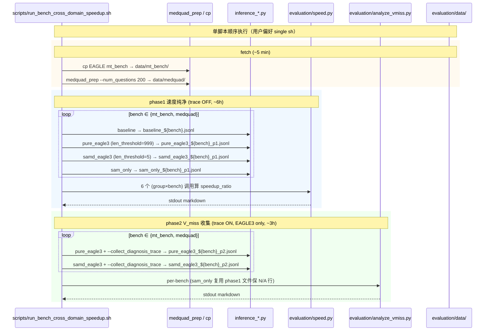

# bench-cross-domain-speedup design

## 0. 术语约定

| 术语 | 定义 | 防冲突结论 |
|---|---|---|
| phase1 / phase2 | 两阶段跑批：phase1 trace OFF 测 wall-time 加速比（4 组 × 2 bench = 8 配置），phase2 trace ON 跑 EAGLE3 两组收 V_miss（2 组 × 2 bench = 4 配置） | 新概念；项目内 grep 无命中 |
| 4 组对照 | (a) `baseline`：`inference_baseline.py` (transformers default greedy)；(b) `pure_eagle3`；(c) `samd_eagle3`；(d) `sam_only` | 沿用上一个 feature 三组命名 + 新增 baseline |
| `tokens_per_second` / `speedup_ratio` | sum(new_tokens)/sum(wall_time) 跨 answer 取均值；samd 组 / baseline 比值 | 沿用 `evaluation/speed.py:65,67` 现有命名 |
| cross-domain | 跨数据集对照：垂直医学（MedQuAD long-form 医患问答）+ 通用对话（mt_bench multi-turn），验证 SAM 切换负贡献是否跨域稳定 | 新概念 |
| **MedQuAD** | NIH National Library of Medicine 真实医学问答数据集，HF 镜像 `lavita/MedQuAD` 含 47K 病人提问 + 医生 long-form 回答。本 feature 截 200 题作 free-form 医学 vertical 评测 | 新概念；与上一个 feature `MedQA` (USMLE MCQ 80 题) **不可 lineage** |
| free-form 评测 | prompt 模板只给问题不强制输出结构（无 "A/B/C/D" / "Answer:" / "Final answer:" 等强提示），模型按 chat template 自由作答 | 新概念，与上一个 feature MCQ medqa_prep 模板对比 |
| mt_bench category | FastChat MT-Bench 8 类别（writing/roleplay/reasoning/math/coding/extraction/stem/humanities） | 沿用 `evaluation/speed.py:9` 已有列表 |

## 1. 决策与约束

### 需求摘要

- **做什么**：在上一个 feature 评测框架基础上：(1) 引入 NIH MedQuAD 200 题作 free-form 医学 vertical bench；(2) 加 mt_bench 80 题通用对话 bench；(3) 加 wall-time 加速比维度（4 组对照含 baseline）；(4) phase1 trace OFF 测速度纯净，phase2 trace ON 跑 EAGLE3 两组收 V_miss
- **为谁**：研究 SAM[EAGLE3] / 纯 EAGLE3 / SAM-only 在垂直 vs 通用、free-form vs MCQ 场景下加速比与 V_miss 差异，验证"垂直医学 V_miss 高 + SAM 切换 -4%" 假设是否在去 MCQ 后仍成立
- **成功标准**：
  1. 产出 mt_bench / medquad 两个 bench 的 phase1 加速比对比表：每组 mean_accept_length / tokens_per_second / speedup_ratio
  2. 产出 mt_bench / medquad 两个 bench 的 phase2 V_miss 对比表（含 sam_only N/A 行复用 phase1 文件）
  3. 整体跑通时间预算 ~10 小时 GPU（含 buffer），single sh 一条命令跑完所有阶段
  4. phase1 / phase2 输出可独立解读（V_miss 来自 phase2，加速比来自 phase1，互不污染）
  5. mt_bench V_miss 与 medquad V_miss 数字对比，能定量回答："V_miss 是医学专名特性还是 LLM 词表覆盖普遍现象"
- **明确不做**：
  1. 不修改 samd 主推理逻辑 / samd_sam_only / inference_*.py forward 行为（继承上一个 feature 纪律）
  2. 不修改 eval_vicuna.py / eval_llama3.py（仅扩 speed.py 一行）
  3. 不引入除 mt_bench / medquad 外的其他 bench（spec_bench / humaneval / gsm8k / legal / finance 都不跑）
  4. 不评估答题正确率
  5. 不与上一个 feature 80 题 MCQ medqa lineage 对比（数据源 / prompt 模板都不同，无法直接对比；80 题 model_answer 留作历史档案）
  6. 不跑 multi-run mean/std（4 组 × 2 bench × 多 run 太重，单 run 数据接受）
  7. 不动 medqa_prep.py / analyze_vmiss.py（基础设施已 ready，本 feature 新增 medquad_prep.py 独立路径）
  8. 不引入新 trace 字段（沿用上一个 feature D5 决策的 7-key schema）

### 复杂度档位

走研究 / 实验代码默认档位，无偏离。本 feature 是上一个 feature 评测框架的**规模 + 维度 + 数据集类型**扩展。

### 关键决策

**D1：medqa 数据源换成 NIH MedQuAD（HF `lavita/MedQuAD`），新写 `evaluation/medquad_prep.py`，prompt 模板 free-form**

用户明确"不要选择题"——上一个 feature 80 题 MCQ MedQA 让模型输出 `A/B/C/D` 模式化 token，可能让 DynSAM 命中率 / V_miss 测量基线不真实。**采用方案**：换 NIH MedQuAD（真实病人提问 + 医生 long-form 回答），prompt 模板：

```
{question}
```

直接把 MedQuAD 病人提问作 turn[0]，FastChat chat template 会自动加 system + user role，模型按习惯 free-form 作答。**被拒方案 A**：沿用 medqa_prep MCQ 200 题 → 用户明确反对；**被拒方案 B**：EAGLE 项目 medqa 1273 题（USMLE MCQ + Final answer: 强结构）→ 仍是 MCQ；**被拒方案 C**：保 USMLE 题去 options + 加 instruction → USMLE 题本就是 MCQ 设计，去 options 后问句"Which of the following..."残留歧义。

**与上一个 feature lineage**：完全断开。上一个 feature 80 题 MCQ medqa model_answer 留作历史档案，不与本 feature 数据对比。`evaluation/data/medqa/` 保留（上一个 feature 数据），本 feature 用新目录 `evaluation/data/medquad/`。

**D2：mt_bench 数据从 `../EAGLE/eagle/data/mt_bench/question.jsonl` cp**

mt_bench 是 FastChat 标准 80 题 multi-turn benchmark，EAGLE 项目已有现成 jsonl，cp 即可。**被拒方案**：写 mt_bench_prep.py 从 FastChat 拉 → 重复造轮子。

**D3：加速比测试分两 phase（trace OFF / ON 分跑）**

phase1 4 组 × 2 bench = 8 配置 trace OFF 测速度；phase2 EAGLE3 两组 × 2 bench = 4 配置 trace ON 收 V_miss。trace ~1% wall-time 增量在加速比上方向性可能反转（如果 samd 与 baseline 加速比接近 1），严格 clean 必须分 phase。**被拒方案**：trace ON 一次跑完 → 加速比数据带 ~1% 上误差。

**D4：扩展 `evaluation/speed.py:73` task 列表加 "medquad"**

`speed.py` 已支持按 `category` 字段过滤算 subtask 加速比。当前 task 列表（line 73）含 `["mt_bench", "translation", "summarization", "qa", "math_reasoning", "rag", "overall"]`，未含 medquad。本 feature 加一行类别支持，不重写。

**D5：4 组配置参数固定**

| 组 | 入口 | 关键参数 | trace |
|---|---|---|---|
| baseline | `inference_baseline.py` | transformers default greedy | N/A |
| pure_eagle3 | `inference_samd.py` | `--tree_method eagle3 --samd_len_threshold 999` | phase1 OFF / phase2 ON |
| samd_eagle3 | `inference_samd.py` | `--tree_method eagle3 --samd_len_threshold 5` | phase1 OFF / phase2 ON |
| sam_only | `inference_sam_only.py` | （继承上一个 feature 参数） | N/A |

所有组通用：`--max-new-tokens 512 --max_cache_len 4096 --template llama3 --model-type llama3 --do-sample False`。

**D6：跑批入口 single sh 一条命令跑完所有阶段**（项目级约定，见 `.codestable/attention.md` "命令与脚本陷阱" 分节）

`scripts/run_bench_cross_domain_speedup.sh` 单脚本顺序执行：fetch 数据 → phase1 (4 组×2 bench) → phase1 analyze (speed.py) → phase2 (2 组×2 bench) → phase2 analyze (analyze_vmiss.py)。飞书通知标各阶段进度。**被拒方案**：拆 3 个 sub-script（fetch / phase1 / phase2）→ 违反用户偏好（"减少认知负担 + 一次启动即可离开"）。

### 前置依赖

- 上一个 feature commit `3bf5797` 已 merge：trace 收集 + analyze_vmiss + inference_samd / inference_sam_only --max_cache_len 都 ready
- GPU 服务器需有 `../EAGLE/eagle/data/mt_bench/question.jsonl`（已确认本地有）
- `pip install 'datasets<3.0'`（继承上一个 feature 约束；medquad_prep 同样依赖 datasets）

## 2. 名词与编排

### 2.1 名词层

#### 现状

- `evaluation/inference_baseline.py:14-25:baseline_forward` — transformers default `model.generate(do_sample=False)`；返回 4 元组；天然无 trace
- `evaluation/inference_samd.py / inference_sam_only.py` — 上一个 feature 已加 `--max_cache_len` + `--collect_diagnosis_trace`
- `evaluation/speed.py:7-69:speed` — 接 samd jsonl + baseline jsonl + tokenizer，按 task 过滤算 tokens_per_second / speedup_ratio
- `evaluation/speed.py:9:mt_bench_list` — FastChat MT-Bench 8 类别硬编码（writing/roleplay/.../humanities）
- `evaluation/speed.py:73:get_single_speedup` — 遍历 task 列表 `["mt_bench", "translation", "summarization", "qa", "math_reasoning", "rag", "overall"]`
- `evaluation/medqa_prep.py` — 上一个 feature 产物，MCQ medqa 用，本 feature 不动
- `evaluation/analyze_vmiss.py` — 三组 jsonl → V_miss 表，本 feature 不动
- `../EAGLE/eagle/data/mt_bench/question.jsonl` — 80 题 FastChat 标准格式

#### 变化

新增：

| 文件 | 职责 |
|---|---|
| `evaluation/data/mt_bench/question.jsonl` | 从 `../EAGLE/eagle/data/mt_bench/` cp（80 题，可放进 .gitignored evaluation/data） |
| `evaluation/data/medquad/question.jsonl` | 200 题 free-form 医学问答，由 medquad_prep.py 生成 |
| `evaluation/medquad_prep.py` | HF `lavita/MedQuAD` → question.jsonl 转换脚本；free-form prompt 模板（直接用 question 字段作 turns[0]） |
| `scripts/run_bench_cross_domain_speedup.sh` | single sh 跑批入口：fetch → phase1 inference → speed analyze → phase2 inference → vmiss analyze；飞书通知 |

修改（最小化）：

| 文件 | 修改 |
|---|---|
| `evaluation/speed.py:73` | `get_single_speedup` task 列表新增 `"medquad"`（一行扩展）；其他逻辑不动 |

不修改：

- `samd/` / `samd_sam_only/` / `evaluation/inference_*.py` / `evaluation/eval_*.py` / `evaluation/medqa_prep.py` / `evaluation/analyze_vmiss.py` 全不动

#### 接口示例

`evaluation/medquad_prep.py` CLI（仿 medqa_prep 风格）：

```bash
python -m evaluation.medquad_prep \
    --num_questions 200 \
    --out_path evaluation/data/medquad/question.jsonl
# 输出每行：{"question_id": int, "category": "medquad", "turns": [<病人提问>]}
```

`scripts/run_bench_cross_domain_speedup.sh` 关键骨架（用户偏好的 single sh）：

```bash
#!/bin/bash
set -e
source .env if exists
# notify() + trap ERR + fmt_elapsed 同上一个 feature

notify "▶ START fetch"
cp ../EAGLE/eagle/data/mt_bench/question.jsonl evaluation/data/mt_bench/
python -m evaluation.medquad_prep --num_questions 200

notify "▶ START phase1 (8 inference, trace OFF, baseline + 3 samd groups × 2 bench)"
for bench in mt_bench medquad; do
    python -m evaluation.inference_baseline --bench-name $bench --model-id baseline_${bench} ...
    python -m evaluation.inference_samd --bench-name $bench --tree_method eagle3 --samd_len_threshold 999 --model-id pure_eagle3_${bench}_p1 ...
    python -m evaluation.inference_samd --bench-name $bench --tree_method eagle3 --samd_len_threshold 5  --model-id samd_eagle3_${bench}_p1 ...
    python -m evaluation.inference_sam_only --bench-name $bench --model-id sam_only_${bench}_p1 ...
done
notify "✓ phase1 done"

notify "▶ phase1 analyze (speed.py 跑 6 个 group×bench)"
for group in pure_eagle3 samd_eagle3 sam_only; do
    for bench in mt_bench medquad; do
        python -m evaluation.speed --file-path ...${group}_${bench}_p1.jsonl --base-path ...baseline_${bench}.jsonl --tokenizer-path $MODEL_PATH
    done
done

notify "▶ START phase2 (4 inference, trace ON, EAGLE3 two groups × 2 bench)"
for bench in mt_bench medquad; do
    python -m evaluation.inference_samd ... --collect_diagnosis_trace --model-id pure_eagle3_${bench}_p2 ...
    python -m evaluation.inference_samd ... --collect_diagnosis_trace --model-id samd_eagle3_${bench}_p2 ...
done
notify "✓ phase2 done"

notify "▶ phase2 analyze (analyze_vmiss 跑 2 个 bench)"
for bench in mt_bench medquad; do
    python -m evaluation.analyze_vmiss --pure_eagle3 ...pure_eagle3_${bench}_p2.jsonl --samd_eagle3 ...samd_eagle3_${bench}_p2.jsonl --sam_only ...sam_only_${bench}_p1.jsonl
done

notify "✅ ALL DONE"
```

`speed.py` 输出示例：

```
============================== Task: medquad ==============================
#Mean accepted tokens: 4.5
Tokens per second:  82.1
Tokens per second for the baseline:  17.8
Speedup ratio:  4.61
```

### 2.2 编排层

#### 主流程图



#### 现状

- 上一个 feature 评测框架基础：单 bench 三组 trace ON 跑批模式
- speed.py 已支持 spec_bench 子任务 + multi-run 模式（本 feature 不用 multi-run）
- 4 个 inference 入口（baseline / samd / sam_only / 其他）forward_func 稳定
- 跑批脚本约定为 single sh（项目 attention.md 已记）

#### 变化

| 位置 | 变化 |
|---|---|
| 跑批拓扑 | 1 bench → 2 bench；3 组 → 4 组（加 baseline）；单 phase → 2 phase（速度 + V_miss 分跑）；多脚本 → 单一 sh |
| 数据集类型 | MCQ medqa → free-form medquad；通用对话 mt_bench 新加 |
| speed.py | 加一行 task 类别 medquad |
| 数据准备 | 复用 medqa_prep 流程不可，新写 medquad_prep；mt_bench 从 EAGLE cp |

#### 流程级约束

- **single sh 不可拆**：项目级约定（attention.md 记录），跑批入口必须一条命令跑完 fetch + phase1 + analyze + phase2 + analyze
- **phase1 / phase2 互相独立**：phase 内部 set -e 严格止血；phase1 失败时 phase2 不启动；phase2 失败不污染 phase1 输出
- **trace OFF / ON 必须 model-id 区分**：phase1 用 `_p1` 后缀，phase2 用 `_p2` 后缀，避免覆盖
- **phase1 + phase2 共用同一份 question.jsonl**：保 prompt 一致，加速比与 V_miss 可在 prompt 维度对齐
- **baseline 只跑 phase1**：transformers default generate 无 trace 概念
- **sam_only 跑 phase1，phase2 复用 phase1 文件**：sam_only 无 t2d 收 V_miss 无意义；analyze_vmiss 接受其 N/A 行
- **错误恢复 + 飞书通知**：set -e + trap ERR + notify 每阶段进度；中途失败可手工注释已完成阶段重跑

### 2.3 挂载点清单

判据："删了它 feature 是否消失？"

| # | 挂载位置 | 文件 / Key | 动作 |
|---|---|---|---|
| 1 | mt_bench 数据 | `evaluation/data/mt_bench/question.jsonl` | 新增（从 EAGLE cp，single sh 内一行命令） |
| 2 | medquad 数据 | `evaluation/data/medquad/question.jsonl` | 新增（medquad_prep.py 产出） |
| 3 | medquad_prep.py | `evaluation/medquad_prep.py` | 新增（HF `lavita/MedQuAD` 下载脚本） |
| 4 | speed.py 支持 medquad 类别 | `evaluation/speed.py:73` task 列表加 "medquad" | 修改一行 |
| 5 | single sh 跑批入口 | `scripts/run_bench_cross_domain_speedup.sh` | 新增 |

5 条，符合 3-5 区间。

### 2.4 推进策略

按 paradigm 维度切片，5 步：

1. **medquad_prep.py 骨架**：写 `evaluation/medquad_prep.py`，CLI 接 `--num_questions 200 --out_path`；用 `datasets.load_dataset('lavita/MedQuAD', split='train')` 下载，截前 200 题，按 free-form 模板（直接 question 字段作 turns[0]）落 jsonl
   - 退出信号：`python -m evaluation.medquad_prep --num_questions 5 --out_path /tmp/medquad_smoke.jsonl` → 文件 5 行；每行 JSON 含 question_id / category=="medquad" / turns:List[str]；turns[0] 不含 "A." / "B." / "Final answer:" 等 MCQ 结构

2. **speed.py 扩 medquad 类别**：修改 `evaluation/speed.py:73:get_single_speedup` task 列表加 `"medquad"`
   - 退出信号：`python -m evaluation.speed --file-path xxx.jsonl --base-path yyy.jsonl --tokenizer-path zzz` stdout 含 medquad task 段（含 tokens/sec / speedup_ratio 数字）

3. **single sh 跑批入口**：写 `scripts/run_bench_cross_domain_speedup.sh`，依次：fetch (cp mt_bench + medquad_prep) → phase1 (8 inference) → speed.py 分析 → phase2 (4 inference) → analyze_vmiss.py 分析；含 source .env / notify() / trap ERR / fmt_elapsed 飞书通知（沿用上一个 feature 模式）
   - 退出信号：`bash -n scripts/run_bench_cross_domain_speedup.sh` shell 语法通过；脚本读 `.env` 失败时 fallback 到默认硬编码路径

4. **端到端 GPU 跑批 + 数据落盘**：在 GPU 上跑 `bash scripts/run_bench_cross_domain_speedup.sh`，预算 ~10 小时
   - 退出信号：(a) `evaluation/data/{mt_bench,medquad}/model_answer/` 各含 6 个 jsonl（4 个 phase1 + 2 个 phase2）；(b) phase1 三组 samd 对 baseline 的 speedup_ratio 均 > 1.0；(c) phase2 EAGLE3 两组在两个 bench 上的 V_miss rate 都是 [0%, 60%] 内的百分比数字（非 None）；(d) sam_only 行 vmiss_rate=="N/A"

5. **结果汇总**：跑完后 stdout 含 4 张表（phase1 speed × 2 bench + phase2 V_miss × 2 bench），用于 acceptance 第 9 节研究发现归并
   - 退出信号：飞书 ✅ ALL DONE 通知含 phase1 / phase2 总用时 + 部分 markdown 表摘要

### 2.5 结构健康度与微重构

#### 评估前

`python .codestable/tools/search-yaml.py --dir .codestable/compound --filter doc_type=decision --filter category=convention --query "目录组织 OR 命名 OR 归属"` —— compound 中无目录组织 / 命名约定 convention 命中。

#### 评估

**文件级（要改的现有文件）**：

- `evaluation/speed.py`（153 行）—— 加 1 行 task 项 = 154 行。健康

**目录级（新文件落进的目录）**：

- `evaluation/`（现有 ~16 项 Python + data/ + model/）+ `medquad_prep.py` = ~17 项。命名延续 `*_prep.py` 模式（与上一个 feature 的 `medqa_prep.py` 对称）。健康
- `scripts/`（现有 17 项 sh）+ `run_bench_cross_domain_speedup.sh` = 18 项。命名延续 `run_*.sh` 模式。健康
- `evaluation/data/`（gitignored，运行时产物）+ `medquad/` 子目录 = 沿用 `bench/{name}/` 模式。健康

#### 结论：不做微重构

所有改动是新增 + 一行 task 列表扩展，不触发文件级 / 目录级偏胖信号。

#### 超出范围的观察

- **`evaluation/speed.py` multi-run 路径硬编码**（line 81-89）：继承上一个 feature acceptance 已记观察；本 feature 不动
- **`evaluation/eval_*.py` 重复代码**：继承上一个 feature 已记；本 feature 不动
- **`medqa_prep.py` 和 `medquad_prep.py` 共享 datasets 加载 + jsonl 写出骨架**：未来如再加新 bench 数据 prep（如 PubMedQA / BioASQ），三份脚本会有 70% 共代码。建议未来抽 `evaluation/_bench_prep_base.py` 公共骨架。本 feature 不做，记为后续 `cs-refactor` 候选

## 3. 验收契约

### 关键场景

**正常路径**：

- **S1（数据准备）**：脚本内 fetch 阶段完成后 `evaluation/data/mt_bench/question.jsonl` 80 行 + `evaluation/data/medquad/question.jsonl` 200 行；medquad 首行 turns[0] 不含 MCQ 结构（grep `"A\\."` 在 turns[0] 字段内为空 / 极少）
- **S2（medquad_prep 输出）**：`python -m evaluation.medquad_prep --num_questions N` → N 行 jsonl；每行含 question_id (int) / category ("medquad") / turns (List[str])；turns[0] 是病人提问 free-form 文本
- **S3（speed.py medquad 支持）**：speed.py 跑任意 file pair → stdout 含 7+ task 段，其中 medquad 段 tokens/sec / speedup_ratio 都是数字
- **S4（phase1 完整产出）**：phase1 完成后 `evaluation/data/{mt_bench,medquad}/model_answer/` 各 4 个 jsonl 文件；行数 = 该 bench 题数（80 / 200）
- **S5（phase2 完整产出）**：phase2 完成后 `evaluation/data/{mt_bench,medquad}/model_answer/` 各 2 个 `_p2.jsonl`；含 diagnosis_traces 字段
- **S6（加速比合理性）**：phase1 三种 samd 组 (pure_eagle3 / samd_eagle3 / sam_only) 相对 baseline 的 speedup_ratio 都 > 1.0；sam_only 在 mt_bench 上可能接近 1.0（DynSAM 通用对话命中率低）
- **S7（V_miss 跨 bench 对比可解释）**：phase2 输出含 mt_bench / medquad 各一张 V_miss 表；两个 bench 的 V_miss rate 差异可量化（数字差 > 5% 或 < 5%，无论方向均能支持研究结论）
- **S8（single sh 一条命令跑完）**：`bash scripts/run_bench_cross_domain_speedup.sh` 单命令启动后无人值守跑完所有阶段；中间不需要用户交互；飞书通知每阶段进度

**关键边界**：

- **S9（trace OFF byte-equal）**：phase1 跑的 pure_eagle3 / samd_eagle3 输出 token 序列与 phase2 同 bench trace ON 跑的输出 byte-equal
- **S10（baseline accept_lengths 字段）**：baseline jsonl 的 `accept_lengths` 字段值都是 1（来自 `inference_baseline.py:24 [1]*new_token`），speed.py 算 mean=1.0 是预期行为
- **S11（mt_bench multi-turn）**：mt_bench 题 turns 长度 2，eval_llama3 正确遍历两轮；ans_json choices[i].turns 长度 == 2
- **S12（medquad free-form 输出验证）**：phase1 medquad answer 文件 choices[i].turns[0] 文本不强制含 "Final answer:" / "A/B/C/D" 类 MCQ 结构（采样 5 条人工核查）

**关键错误路径**：

- **S13（中途失败可恢复）**：脚本任一阶段失败后已落盘 jsonl 保留；用户改脚本注释已完成 phase 重跑剩余阶段即可
- **S14（数据缺失警告）**：脚本 fetch 阶段若 `../EAGLE/eagle/data/mt_bench/question.jsonl` 不存在 → 报清晰错误指明路径；medquad_prep 如 `datasets` 库不可用 → 给清晰 ImportError（沿用上一个 feature pattern）
- **S15（飞书 webhook 未配置）**：notify() 函数 graceful degrade 到 stdout（沿用上一个 feature pattern）

**回归**：

- **S16（samd / samd_sam_only / eval_*.py 不动）**：`git diff samd/ samd_sam_only/ evaluation/eval_llama3.py evaluation/eval_vicuna.py evaluation/inference_*.py evaluation/medqa_prep.py evaluation/analyze_vmiss.py` 应为空
- **S17（上一个 feature MedQA 80 题数据完整保留）**：`evaluation/data/medqa/` 目录下的 `model_answer/{pure_eagle3,samd_eagle3,sam_only}.jsonl` 不被覆写（本 feature 用 `evaluation/data/medquad/` 新目录，与 medqa 互不干扰）

### 明确不做反向核对

- **R1**：`git diff samd/` 应为空（不动主推理）
- **R2**：`git diff samd_sam_only/` 应为空
- **R3**：`git diff evaluation/eval_vicuna.py evaluation/eval_llama3.py` 应为空
- **R4**：`git diff evaluation/inference_samd.py evaluation/inference_sam_only.py evaluation/inference_baseline.py` 应为空（不动 forward 逻辑）
- **R5**：`git diff evaluation/medqa_prep.py evaluation/analyze_vmiss.py` 应为空（不动上一个 feature 工具）
- **R6**：`grep -rE "spec_bench|humaneval|gsm8k|legal|finance|alpaca|MedQA[^u]" scripts/run_bench_cross_domain_speedup.sh evaluation/medquad_prep.py` 应为空（不引其他 bench / 不混 MCQ MedQA）
- **R7**：`grep -rE "accuracy|correct|answer_correct|grade" scripts/run_bench_cross_domain_speedup.sh evaluation/medquad_prep.py` 应为空（不评估答题正确率）
- **R8**：`grep -rE "A\\.|B\\.|C\\.|D\\.|Final answer|Answer:" evaluation/medquad_prep.py` 应为空（不写 MCQ 强结构 prompt 模板）
- **R9**：scripts/run_bench_cross_domain_speedup.sh 不调用 `bash scripts/run_phase1*.sh` 或 `bash scripts/run_phase2*.sh`（single sh 约定，不拆 sub-script）

## 4. 与项目级架构文档的关系

**预判 acceptance 阶段要提炼回 architecture**：

- **`ARCHITECTURE.md` 第 3 节 evaluation 子节扩展** → `evaluation/medquad_prep.py` 加入文件清单；`scripts/run_bench_cross_domain_speedup.sh` 作为"两阶段跨 bench 跑批入口"加入
- **`ARCHITECTURE.md` 第 5 节硬约束新增**："V_miss 与 wall-time 加速比应分两阶段跑（trace OFF 测速度 + trace ON 收诊断），同一 bench 不能用同次产出"——这条约束之前已经在 design D3 提出，acceptance 后正式归入硬边界
- **建议独立 doc**：`architecture/evaluation-phased-bench-protocol.md`（type 段 evaluation），记录 phase1 / phase2 / analyze 三层职责。本 feature 不强制写，建议 acceptance 阶段评估

**与 requirement 关系**：本 feature 不引入新能力，沿用 `evaluation-vmiss-diagnosis` req。本 feature 是该 req 的**实证扩展**：用 cross-domain + 加速比 + free-form 三个维度强化对该能力的验证；acceptance 后 req 可补一条变更日志说明"已在 cross-domain + 加速比 + free-form 维度验证"。

**关联已有架构 doc**：当前仅 `ARCHITECTURE.md`。本 feature 完成后建议 acceptance 后触发 `cs-arch backfill` 补 evaluation 子系统专项 doc（与上一个 feature 共享建议）。
