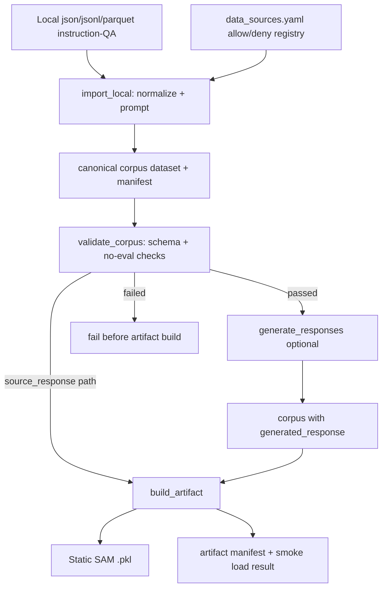

# static-sam-offline-corpus design

## 0. 术语约定

| 术语 | 定义 | 防冲突结论 |
|---|---|---|
| Static SAM | 离线构建的后缀自动机，用于在推测解码时从 prompt / 文本库中查找可复用 token draft | 既有概念；README 和 `.codestable/architecture/ARCHITECTURE.md` 已用该叫法，本 feature 沿用，不改 `samd/sam/static_sam.py` 核心语义 |
| offline corpus / canonical corpus | 模型无关的标准文本语料库，保存 instruction/QA 样本、领域、来源、许可、评测排除理由、原始答案和生成答案 | 新增概念；与 `evaluation/data/*/question.jsonl` 区分，后者是评测输入，本 feature 的 corpus 是 Static SAM 构建输入 |
| source response | 数据源自带答案 / 回复，标准化后落 `source_response` | 新增字段名；与现有 `tools/gen_response.py` 生成的 `response` 区分 |
| generated response | 用指定 base model / vLLM 从 `prompt` 重新生成的答案，标准化后落 `generated_response` | 新增字段名；用于区分原始答案和模型风格答案，后续 artifact 构建通过 response field 选择 |
| data source registry | `allowed_sources` / `denied_sources` 配置，记录哪些 source 可以进入 Static SAM，哪些 benchmark/eval source 必须拒绝 | 新增概念；当前仓库没有 data source registry 或 manifest 机制 |
| artifact manifest | 与 `.pkl` Static SAM 同目录的可读 JSON 元数据，说明 corpus、tokenizer、response field、样本统计和 eval 排除校验结果 | 新增概念；弥补现有 `.pkl` artifact 不可读、来源不可追溯的问题 |
| strict no-eval dataset | 构建 Static SAM 时严格排除常见 benchmark/eval 数据集，即使它们有 train split 也不纳入 | 新增约束；与已有 `evaluation/` 数据准备脚本区分，评测数据不能作为本 feature 的构建输入 |

## 1. 决策与约束

### 需求摘要

- **做什么**：新增一条可复用的 Static SAM 离线语料构建管线，支持本地 medical / finance instruction-QA 数据导入、schema 校验、可选模型生成 response，并按指定 tokenizer 构建 `.pkl` Static SAM artifact 与 artifact manifest。
- **为谁**：需要在医疗、金融等垂直领域做 SAM-Decoding 加速实验、且要避免 benchmark 数据污染的研究者。
- **成功标准**：
  1. 本地 `json/jsonl/parquet` instruction-QA 数据能被导入 canonical corpus，并生成 corpus manifest。
  2. 校验阶段会阻止 `is_eval_dataset=True`、denylist source、未授权 source 进入 Static SAM 构建。
  3. corpus 同时支持 `source_response` 与 `generated_response`，构建 artifact 时可显式选择 response field。
  4. 构建出的 `.pkl` 能被现有 `samd.load_sam()` 加载。
  5. artifact manifest 能追溯 corpus id、domain/source 分布、response field、model/tokenizer、cutoff_len、跳过/截断统计和 strict no-eval 校验结果。
- **明确不做**：
  1. 不自动抓取大量公开医疗 / 金融数据集；第一版以本地数据导入为主，公开源只预留 allowlist 入口。
  2. 不使用 MedQA、PubMedQA、MedMCQA、MMLU medical subsets、FinQA、TAT-QA、ConvFinQA、FinanceBench 等常见 benchmark/eval 数据集，即使有 train split 也不纳入。
  3. 不把评测闭环纳入本 feature；不跑 `no static SAM` / `generic static SAM` / `medical+finance static SAM` 三组实验。
  4. 不评估医学或金融问答准确率。
  5. 不修改 `samd/sam/static_sam.py`、`samd/samd_model.py` 或现有推理路径。
  6. 不重写现有 `tools/prepare_prompts.py` / `gen_response.py` / `gen_sam_alpaca.py` 四步脚本；它们继续作为旧流程存在。
  7. 第一版 artifact builder 默认面向 `samd.build_sam` / `samd.dump_sam`；`samd_sam_only` 平行 artifact 可后续扩展，不在本 feature 强制覆盖。
  8. 不做复杂 license 法务判断，只把 license / 使用限制作为 manifest 字段和校验输入记录。

### 复杂度档位

项目内部工具默认档位是 `L2 + functions + reasonable + team + active + logged + testable`。本 feature 有以下偏离：

- **健壮性 = L3 严防**（偏离默认 L2）：输入来自用户本地文件，且 benchmark/eval 排除是实验可信度硬约束，必须对外部输入、source registry、response field 和 artifact 构建前置条件做明确校验。
- **结构 = modules**（偏离默认 functions）：现有 `tools/` 脚本是一组一次性入口；本 feature 至少包含 schema、registry、导入、校验、生成、构建几个独立职责，放在单文件会变成新的胖脚本。
- **可测试性 = tested**（偏离默认 testable）：denylist、`is_eval_dataset=True`、response field 为空、manifest 统计这些规则必须有小样本测试，否则后续实验污染难以及时发现。
- **确定性 = reproducible**（新增场景维度）：同一 canonical corpus、response field、tokenizer 和 cutoff_len 应能复现同一类 artifact；生成 response 本身可能受采样参数影响，但参数必须写入 manifest。
- **安全性 = validated**（新增场景维度）：本 feature 不运行不可信代码，但会读取外部数据文件，需校验字段、空值、source 归属和 denylist。

### 关键决策

**D1：用 canonical text corpus 与 tokenizer-specific SAM artifact 分层**

Static SAM 的 `.pkl` 与 tokenizer 强绑定，但原始 instruction/QA 数据不应绑定 Vicuna 或 Llama。第一版先生成模型无关的 canonical corpus，再按 `model_name/tokenizer` 构建 artifact。这样同一份 medical/finance 数据以后可以复用到 Vicuna、Llama-3/3.1 或其他 Llama tokenizer。**被拒方案**：直接在导入时 tokenize 并构建 `.pkl` —— 会让 corpus 难以复用，也无法对 `source_response` / `generated_response` 做 ablation。

**D2：第一版数据形态限定为 instruction/QA**

用户明确选择 A：本 feature 先服务 instruction/QA 风格数据，导入后统一生成 prompt，再用 `prompt + selected_response` 构建 SAM。真实领域长文档 / 指南 / 年报直接入库的语料型方案先不做。**被拒方案**：混合真实语料 + QA —— 覆盖更广，但会让首版 schema、采样和命中率解释同时变复杂。

**D3：严格排除 benchmark/eval 数据集**

只要 source 是常见评测集或常被当 benchmark 使用，就默认 deny，即使它有 train split 也不进入 Static SAM。manifest 必须记录 `is_eval_dataset=false` 和 `eval_exclusion_reason`。**被拒方案**：只排除 test/dev split —— 数据更多，但论文实验更容易被质疑 contamination。

**D4：本地导入为主，allowlist 公开源为扩展点**

第一版必须能从用户本地 `json/jsonl/parquet` 导入数据；公开数据源先通过 `data_sources.yaml` 的 `allowed_sources` 逐步加入，不在代码里写死自动下载。**被拒方案**：内置一批公开医疗 / 金融源并自动下载 —— 需要逐个确认 license 和 benchmark 身份，容易把 feature 拖成数据平台建设。

**D5：同时保存 `source_response` 与 `generated_response`，构建时选择 response field**

source answer 可复现、成本低；generated answer 更贴近目标模型输出风格，可能提高 Static SAM 命中。两者都保留，artifact builder 通过 `--text-response-field source_response|generated_response` 选择。第一版默认推荐 `generated_response`，但不强制。**被拒方案**：只保留 generated response —— 无法追溯原始答案，也无法做 source vs generated 对照。

**D6：新建 `tools.static_sam` 工具包，不继续扩张旧脚本**

当前 `tools/prepare_prompts.py` 硬编码 alpaca/code/gsm8k 路径，`gen_response.py` 固定读写 `sam_data/sam_prompts` / `sam_data/sam_dialogues`，`gen_sam_alpaca.py` 固定读取 prompt+response。把 registry、manifest、校验和多 response field 继续塞进旧脚本会让旧流程难以理解。第一版新增 `tools/static_sam/`，旧脚本保留。**被拒方案**：在旧脚本上加大量参数 —— 改动少但长期不可维护。

**D7：artifact 构建完成后立即 smoke load**

`.pkl` 不可读，且 StaticSAM 类结构变动时 pickle 容易变成“写成功但加载失败”。`build_artifact` 完成后应调用 `samd.load_sam(path)` 做 smoke check，并把结果写入 artifact manifest。**被拒方案**：只 dump 不 load —— 失败会推迟到推理实验阶段才暴露。

### 前置依赖

- 现有 `samd.build_sam` / `samd.dump_sam` / `samd.load_sam` 可用。
- 现有 `tools/prompter.py:Prompter` 可复用 prompt template 逻辑。
- `datasets` 已在当前 Static SAM 工具链中使用；`vllm` 仅用于可选 `generated_response` 阶段。

## 2. 名词与编排

### 2.1 名词层

#### 现状

- `tools/prepare_prompts.py` — 硬编码加载 `alpaca-cleaned`、`python_code_instructions_18k_alpaca`、`gsm8k` 三类数据，统一处理成只有 `prompt` 字段的 HF Dataset，保存到 `sam_data/sam_prompts`。
- `tools/data_utils.py:process_alpaca/process_gsm8k` — 只处理 alpaca-like 与 gsm8k 两种格式，输出 `{"prompt": full_prompt}`。
- `tools/gen_response.py` — 从 `sam_data/sam_prompts` 读取 prompt，用 vLLM 生成 response，保存 `prompt/response` 到 `sam_data/sam_dialogues`。
- `tools/gen_sam_alpaca.py` — 从 `sam_data/sam_dialogues` 读取 `prompt/response`，拼接 tokenize，追加 tokenizer 每个 token 的 singleton sequence，调用 `samd.build_sam` 并 dump 到固定路径。
- `tools/gen_sam_alpaca_sam_only.py` — 与上一条同构，但导入 `samd_sam_only` 包。
- `tools/prompter.py:Prompter` — 根据 `sam_data/templates/{template}.json` 生成 instruction/input prompt；现有工具可复用它生成 canonical `prompt`。
- `samd/sam/utils.py:build_sam/dump_sam/load_sam` — StaticSAM 构建与 pickle 读写入口，当前不记录 artifact 来源。

现状里没有 source registry、canonical schema、corpus manifest、artifact manifest，也没有 benchmark/eval denylist。

#### 变化

- 新增 **CanonicalStaticSamSample** 概念：每条样本统一包含 `sample_id/domain/source_id/source_name/source_url/license/instruction/input/prompt/source_response/generated_response/response_generator/response_generated_at/is_eval_dataset/eval_exclusion_reason/split/tags`。
- 新增 **DataSourceRegistry** 概念：由 `allowed_sources` 与 `denied_sources` 组成，至少记录 `source_id/domain/source_name/license/is_eval_dataset/eval_exclusion_reason/allow_generated_response/allow_static_sam_build`。
- 新增 **CorpusManifest** 概念：记录 corpus id、schema version、domain/source 统计、response field 可用数、校验状态与 denylist 命中情况。
- 新增 **ArtifactManifest** 概念：记录 artifact id、corpus id、model/tokenizer、response field、cutoff_len、有效样本数、跳过/截断数、domain/source 统计、strict no-eval 校验结果、sam_path 和 smoke load 结果。
- 新增 **Static SAM toolkit CLI**：围绕 import、validate、generate responses、build artifact 四个阶段暴露命令入口。具体模块文件由实现阶段决定，但对外 CLI 语义应稳定。

#### 接口示例

本地导入输入示例：

```json
{"question": "What is hypertension?", "context": "", "answer": "Hypertension is persistently elevated blood pressure."}
```

导入命令示例：

```bash
python -m tools.static_sam.import_local \
  --input data/raw_static_sam/medical.jsonl \
  --domain medical \
  --source-id local_medical_qa_v1 \
  --source-name "Local Medical QA v1" \
  --license "internal/research-only" \
  --eval-exclusion-reason "local domain QA, not a benchmark or evaluation dataset" \
  --instruction-field question \
  --input-field context \
  --response-field answer \
  --prompt-template-name vicuna \
  --output sam_data/static_corpus/medical_finance_v1
```

canonical sample 输出示例：

```json
{
  "sample_id": "local_medical_qa_v1:000000",
  "domain": "medical",
  "source_id": "local_medical_qa_v1",
  "source_name": "Local Medical QA v1",
  "source_url": "",
  "license": "internal/research-only",
  "instruction": "What is hypertension?",
  "input": "",
  "prompt": "A chat between ... USER: What is hypertension?\n\nASSISTANT: ",
  "source_response": "Hypertension is persistently elevated blood pressure.",
  "generated_response": "",
  "response_generator": "",
  "response_generated_at": "",
  "is_eval_dataset": false,
  "eval_exclusion_reason": "local domain QA, not a benchmark or evaluation dataset",
  "split": "static_sam_train",
  "tags": ["medical"]
}
```

artifact 构建示例：

```bash
python -m tools.static_sam.build_artifact \
  --corpus-path sam_data/static_corpus/medical_finance_v1 \
  --model-name /data/models/vicuna-7b-v1.3 \
  --text-response-field generated_response \
  --cutoff-len 2048 \
  --on-too-long skip \
  --sam-path local_cache/static_sam/medical_finance_v1/vicuna-7b-v1.3.generated_response.pkl
```

### 2.2 编排层



#### 现状

当前 Static SAM 流程是线性一次性脚本：

```text
prepare_prompts.py -> gen_response.py -> gen_sam_alpaca.py / gen_sam_alpaca_sam_only.py
```

每一步默认固定路径和字段：`sam_data/sam_prompts`、`sam_data/sam_dialogues`、`prompt/response`。脚本没有 source registry、没有 eval denylist、没有 manifest，也没有把 corpus 与 tokenizer-specific artifact 分层。

#### 变化

新流程升级为四阶段 pipeline：

1. **Import**：从本地文件读取 instruction/input/answer 字段，生成 prompt，写入 canonical corpus。source metadata 从 CLI 与 registry 合并。
2. **Validate**：在 artifact 构建前检查 schema、domain、source registry、denylist、`is_eval_dataset`、空 prompt/response、重复 sample_id 等规则。
3. **Generate responses（可选）**：对缺失 `generated_response` 的样本调用 vLLM，写回生成结果和生成参数；支持小样本 `--limit` 与 `--resume`。
4. **Build artifact**：按 `prompt + selected_response` tokenize，处理超长样本，调用 `samd.build_sam/dump_sam`，写 artifact manifest，并立刻 smoke load。

#### 流程级约束

- **错误语义**：污染实验可信度的问题直接失败，包括 eval dataset、denylist source、未授权 source、必填字段缺失、选中 response field 为空、重复 sample_id。license/source_url 缺失等可先 warning 并写入 manifest。
- **幂等性**：同一 source_id 与输入顺序生成稳定 sample_id；`generate_responses --resume` 默认跳过已有 generated_response；重复运行 import 不应静默覆盖不同 corpus，除非显式允许覆盖。
- **顺序约束**：artifact build 必须先通过 validate；generated_response 缺失不阻塞 validate，但若 build 选择 `generated_response` 则阻塞。
- **扩展点**：新增 domain/source 通过 registry 扩展；新增公开数据源下载 adapter 不进入第一版主路径；新增 tokenizer 只影响 artifact build，不改变 corpus。
- **可观测点**：每阶段打印样本数、domain/source 分布、warning/error 摘要；manifest 持久化完整统计，避免只靠 stdout 追溯。

### 2.3 挂载点清单

- `tools.static_sam` CLI 命名空间 — 新增 import / validate / generate / build 四阶段工具入口；删掉后本 feature 的用户可见命令消失。
- `tools/static_sam/data_sources.yaml` registry — 新增 allowed/denied source 配置；删掉后 strict no-eval source gate 无法运行。
- `sam_data/static_corpus/{corpus_id}/` corpus layout — 新增 canonical dataset + `manifest.json` 约定；删掉后模型无关的离线数据库不存在。
- `local_cache/static_sam/{corpus_id}/` artifact layout — 新增 `.pkl` + artifact manifest 约定；删掉后无法追溯 model-specific Static SAM artifact。
- `tests` 中的 static SAM pipeline 小样本校验 — 新增污染防护和 manifest 统计回归入口；删掉后 denylist / no-eval / response field 规则没有自动保护。

### 2.4 推进策略

1. **编排骨架：schema + registry + validate 主干**
   - 退出信号：fake corpus 能跑 validate；`is_eval_dataset=True` 和 denylist source 会失败。
2. **导入节点：local json/jsonl/parquet -> canonical corpus**
   - 退出信号：3-5 条 fake medical/finance 样本能导入 dataset，manifest 统计与样本一致。
3. **生成节点：optional generated_response 回写**
   - 退出信号：`--limit` 小样本生成或 stubbed/smoke 路径能填充 `generated_response/response_generator/response_generated_at`，`--resume` 不重复生成。
4. **构建节点：response field -> tokenizer-specific Static SAM artifact**
   - 退出信号：选择 `source_response` 或 `generated_response` 均可构建小 `.pkl`，并被 `samd.load_sam()` smoke load。
5. **持久化与可观测：corpus/artifact manifest 完整化**
   - 退出信号：manifest 记录 corpus、source/domain 分布、response field、tokenizer、cutoff_len、跳过/截断统计、strict no-eval 结果。
6. **测试覆盖：小样本与边界规则**
   - 退出信号：local import、denylist、eval flag、空 response field、artifact build/load、manifest 统计都有自动或手工可复现证据。

### 2.5 结构健康度与微重构

##### 评估

- 文件级 — `tools/prepare_prompts.py`：约 30 行，职责单一但硬编码旧数据源；本 feature 不修改它，只把新流程放到新工具包。
- 文件级 — `tools/gen_response.py`：约 35 行，职责单一但路径固定；本 feature 不直接扩展它，避免在旧脚本里叠加 manifest / resume / response field 逻辑。
- 文件级 — `tools/gen_sam_alpaca.py` / `tools/gen_sam_alpaca_sam_only.py`：约 40 行，职责单一但重复；本 feature 第一版不做去重重构，因为去重会牵涉 `samd` 与 `samd_sam_only` artifact 差异，超出当前目标。
- 文件级 — `tools/prompter.py`：约 40 行，职责清晰，可复用；本 feature 只消费它的 prompt building 语义，不要求修改。
- 目录级 — `tools/`：现有约 9 个同层脚本，已经偏平；本 feature 不继续在 `tools/` 根下新增 4-6 个平铺脚本，而是新增 `tools/static_sam/` 子包承载新 pipeline。
- 目录级 — `tests/`：现有约 5 个测试文件，本 feature 预计新增 1 个 focused pipeline 测试文件，不触发目录重组。
- compound convention 检索：未命中目录组织 / 命名 / 归属类 decision。

##### 结论：不做微重构

本 feature 通过新建 `tools/static_sam/` 避免继续扩大旧脚本和 `tools/` 根目录摊平，但不搬迁旧脚本、不合并 `gen_sam_alpaca*`，因为这些属于旧流程整理，不是构建 offline corpus 的必要前置。

##### 超出范围的观察

- `tools/gen_sam_alpaca.py` 与 `tools/gen_sam_alpaca_sam_only.py` 存在重复结构，未来若需要同时稳定支持 `samd` / `samd_sam_only` artifact，可另起 `cs-refactor` 抽出共享 tokenization/build 逻辑；本 feature 不阻塞。

## 3. 验收契约

### 关键场景清单

- **S1 本地导入正常路径**：给定 2 条 medical + 2 条 finance fake instruction/QA jsonl，执行 import → `sam_data/static_corpus/<id>/dataset` 存在，样本含 canonical schema 必填字段，manifest 的 domain/source 计数与输入一致。
- **S2 denylist source 阻断**：给定 `source_id=medqa` 或 registry denied source，执行 validate / build → 失败，错误信息包含 source_id 和 deny reason，不生成 artifact。
- **S3 eval flag 阻断**：给定任一样本 `is_eval_dataset=True`，执行 validate / build → 失败，错误信息说明 eval dataset 不能进入 Static SAM。
- **S4 未注册 source 阻断**：给定 source_id 不在 allowlist，且未显式传本地未注册放行参数 → validate 失败；显式放行时 manifest 必须记录该 source 为 local/unregistered。
- **S5 response field 选择**：同一小 corpus 同时含 `source_response` 与 `generated_response`，分别用两个 response field build → 产出两个 artifact manifest，`response_field` 不同，两个 `.pkl` 都能被 `samd.load_sam()` 加载。
- **S6 selected response 为空**：选择 `generated_response` 构建但该字段为空 → build 失败，错误信息提示先运行 generate_responses 或改用 source_response。
- **S7 超长样本处理**：构建时遇到 `prompt + response` token 长度超过 `cutoff_len`，默认 `skip` 并在 artifact manifest 记录 skipped count；选择 `truncate` 时记录 truncated count。
- **S8 generated_response resume**：已有 generated_response 的样本再次执行 generate with `--resume` → 不重复生成；manifest / 日志显示 skipped existing count。
- **S9 artifact 可追溯**：构建完成后 artifact manifest 包含 corpus id、model/tokenizer、response field、cutoff_len、sample_count、domain/source counts、strict_no_eval_dataset=true、sam_path、built_at、smoke_load=true。
- **S10 核心推理路径不变**：`git diff samd/sam/static_sam.py samd/samd_model.py samd/tree_model/ samd/model_patch/` 为空；现有 `samd.load_sam()` API 不变。

### 明确不做的反向核对项

- 不应新增自动下载公开 medical/finance 数据源并默认纳入 corpus 的入口。
- `data_sources.yaml` 的 denied_sources 应包含 MedQA、PubMedQA、MedMCQA、MMLU medical、FinQA、TAT-QA、ConvFinQA、FinanceBench 等常见评测源。
- 本 feature 不应新增或修改 evaluation benchmark runner 来声称加速效果。
- 本 feature 不应修改 `samd/sam/static_sam.py`、`samd/samd_model.py`、`samd/tree_model/`、`samd/model_patch/`。
- artifact manifest 不应省略 corpus/source/domain/response field/tokenizer 信息。

## 4. 与项目级架构文档的关系

本 feature 会把 `tools/` 从“一组一次性 Static SAM 构建脚本”扩展为“旧脚本 + 新 static_sam pipeline”并存的结构。acceptance 阶段应更新 `.codestable/architecture/ARCHITECTURE.md` 中 `tools/` 条目，至少提炼以下系统级信息：

- Static SAM 数据构建从旧的 alpaca/gsm8k/python hardcoded 流程扩展出 `tools.static_sam` 分阶段 pipeline。
- canonical corpus 与 tokenizer-specific artifact 分层。
- strict no-eval dataset 是 Static SAM corpus 构建的长期约束。
- artifact manifest 是 `.pkl` 来源追溯的标准出口。

如果实现后 `tools/static_sam/` 成为稳定子系统，可由 acceptance 判断是否补一份 `architecture/tools-static-sam.md`；第一版 design 不强制预建子架构文档。
