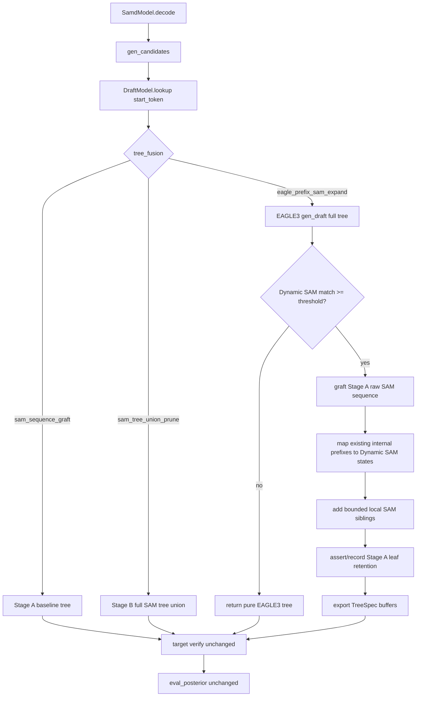

# eagle-prefix-sam-local-expansion design

## 0. 术语约定

| 术语 | 定义 | 防冲突结论 |
|---|---|---|
| Stage A baseline tree | `tree_fusion="sam_sequence_graft"` 产生的候选树：完整 EAGLE3 tree + 命中阈值时的一条 Dynamic/Static SAM raw sequence branch | Stage B2 必须以它为主基线，而不是回退到 pure EAGLE3 |
| EAGLE-prefix anchor | Stage A baseline tree 中已经存在、且其 root→node token path 可在 Dynamic SAM 当前状态中转移到的内部节点 | 区别于 Stage B 的 root-level SAM tree；anchor 必须来自已有 tree prefix |
| local SAM sibling | 在某个 EAGLE-prefix anchor 下，由 Dynamic SAM 当前状态 top transition 产生的一个额外 child token | 第一版只补一跳 sibling，不递归展开成 SAM subtree |
| leaf-retention invariant | Stage B2 输出的候选路径必须保留 Stage A baseline tree 的所有 retrieve leaf path | 用来避免 Stage B 中“给叶子加 child 导致原 leaf candidate 消失”的风险 |
| `eagle_prefix_sam_expand` | 新增 `tree_fusion` 策略名，表示 Stage A sequence graft + EAGLE-prefix-guided local SAM sibling expansion | 不新增 `tree_method`，继续只支持 `tree_method="eagle3"` |

## 1. 决策与约束

### 需求摘要

- **做什么**：在 Stage A `sam_sequence_graft` 已经跑赢的基础上，新增一个更保守的融合策略：先构造 Stage A baseline tree，再只在已有 EAGLE / Stage-A prefix 的内部节点上补少量 Dynamic SAM local siblings。
- **为谁**：做 SAM-Decoding + EAGLE3 融合实验的研究者，想验证“比单条 SAM sequence 多一点点局部 alternatives”是否有收益，同时避免 Stage B 整棵 SAM tree union 带来的 verifier 成本和候选语义漂移。
- **成功标准**：
  1. 默认 `tree_fusion="none"`、Stage A `sam_sequence_graft`、Stage B `sam_tree_union_prune` 行为不变。
  2. 新策略 `eagle_prefix_sam_expand` 仅支持 `tree_method="eagle3"`。
  3. `sam_prefix_max_added_nodes=0` 时，新策略应退化为 Stage A baseline tree，用作 correctness diagnostic。
  4. `sam_prefix_max_added_nodes>0` 时，输出 tree 必须保留 Stage A baseline 的所有 leaf candidate paths。
  5. 第一版只补 local siblings，不从 root 直接 graft 整棵 SAM tree，不递归扩展 SAM subtree。
  6. 最小实验在 MT-Bench / MedQuAD 上对比 Stage A 与 Stage B2；tokens/s 不应明显下降，mean_accept 或 V_miss 至少一项改善才继续。
- **明确不做**：
  1. 不重跑 Stage B `sam_tree_union_prune` 的大 budget grid。
  2. 不删除或重排 EAGLE3 节点。
  3. 不直接比较 EAGLE3 score 和 SAM `cnt_endpos` 做跨源全局裁剪。
  4. 不改变 verifier / `eval_posterior()` 接受规则。
  5. 第一版不引入 StaticSAM multi-branch tree；仍以 Dynamic SAM 为 local sibling 来源。
  6. 第一版不在原 Stage A leaf 下继续加 child；否则会破坏 leaf-retention invariant。

### 复杂度档位

走研究 / 实验代码默认档位，但这里有两个偏离点：

- **correctness diagnostic 优先于测速**：因为 Stage B 出现了 mean_accept 下降，Stage B2 必须先证明 candidate set 保留 Stage A leaf paths。
- **预算必须小且可记录**：local expansion 的默认 budget 应该小于 Stage B，先验证“少量局部补洞”而不是“树越大越好”。

### 关键决策

**D1：Stage B2 基于 Stage A，而不是替代 Stage A**

Stage A sequence graft 是目前最强结果。Stage B2 的候选树构造顺序是：

```text
EAGLE3 full tree
  -> 若 SAM match 达阈值，先 graft Stage A raw SAM sequence
  -> 在已有内部 prefix anchors 上补少量 Dynamic SAM siblings
```

因此 Stage B2 不是“再做一棵 SAM tree”，而是在 Stage A 上做小幅 local expansion。

**D2：只在已有内部节点补 sibling，保证原 leaf paths 保留**

`TreeSpec.to_buffer_lists()` 当前从结构叶子生成 retrieve paths。若给一个原本是 leaf 的节点加 child，该 leaf path 就会从 candidates 中消失。Stage B 可能因此不是 Stage A 的严格候选超集。Stage B2 第一版规避这个问题：只选择 Stage A baseline tree 中已经是 internal node 的 anchor 补 child，不给 leaf 加 child。

**D3：anchor 必须 EAGLE-prefix / Stage-A-prefix 对齐到 Dynamic SAM 状态**

root-level 多分支 SAM union 在 Stage B 中带来低价值分支。Stage B2 只在现有 tree path 能沿 Dynamic SAM 状态转移的位置补 sibling，避免从 root 直接加入大量无关分支。

概念示例：

```text
已有 tree path: start_token -> a -> b
Dynamic SAM lookup(start_token) 后沿 a,b 均可转移
则节点 b 是 EAGLE-prefix anchor，可以补 Dynamic SAM 状态 top transitions 中尚不存在的 child token
```

**D4：第一版只做 one-hop local sibling expansion**

新增 SAM token 作为 anchor 的一个 leaf child；新增 SAM child 不再递归展开。这样 verifier cost 可控，并且更容易解释 V_miss 变化。

**D5：预算是新增 sibling budget，不复用 Stage B 的 subtree budget**

Stage B 的 `sam_tree_max_nodes/top_k/alpha/max_depth` 表示“生成 SAM tree”。Stage B2 语义不同，建议使用单独配置：

```python
sam_prefix_max_added_nodes: int = 4   # 允许 0，用于退化到 Stage A diagnostic
sam_prefix_top_k: int = 2
sam_prefix_min_depth: int = 1
sam_prefix_max_depth: Optional[int] = 4
```

第一组实验预算建议：`max_added_nodes=4, top_k=2, min_depth=1, max_depth=4`。

### 实验假设

If we add a very small number of Dynamic-SAM local sibling candidates only at EAGLE/Stage-A prefix anchors, then V_miss or mean accepted tokens should improve over Stage A without materially reducing tokens/s, because the added candidates target local holes while preserving all Stage A candidate paths.

## 2. 名词与编排

### 2.1 名词层

#### 现状

- `samd/samd_config.py:25` — `tree_fusion` 当前支持 `none / sam_sequence_graft / sam_tree_union_prune`，Stage B budget 用 `sam_tree_*` 字段。
- `samd/draft.py:87` — `DraftModel.lookup(start_token)` 先做 SAM lookup；Stage A branch 在 `sam_sequence_graft` 下先调用 EAGLE3，再 graft raw SAM sequence；Stage B branch 在 `sam_tree_union_prune` 下构造 Dynamic SAM tree 后 union。
- `samd/tree_model/fusion.py:104` — `TreeSpec.graft_sequence()` 支持 Stage A sequence branch。
- `samd/tree_model/fusion.py:127` — `TreeSpec.union_sam_tree()` 支持 Stage B full SAM tree union，但不会显式保留原 leaf terminals。
- `samd/sam/tree_draft.py:9` — `SamTreeBudget` / `build_sam_tree()` 负责 Stage B subtree budget；排序来自 Dynamic SAM `cnt_endpos`。
- `samd/sam/dyn_sam.py:127` — `DynSAM.gen_tree_draft()` 能从在线 SAM 状态生成预算内 tree；`cnt_endpos` 已在线维护。
- `docs/experiments/results/2026-06-01-sam-eagle3-tree-union-pruning.md` — Stage B m16/k4 在 MT-Bench / MedQuAD 均输给 Stage A，且 V_miss 更差。

#### 变化

1. **新增 fusion 策略**

   ```python
   tree_fusion: Literal[
       "none",
       "sam_sequence_graft",
       "sam_tree_union_prune",
       "eagle_prefix_sam_expand",
   ]
   ```

   新策略只支持 `tree_method="eagle3"`。

2. **新增 local expansion budget**

   ```python
   sam_prefix_max_added_nodes: int = 4
   sam_prefix_top_k: int = 2
   sam_prefix_min_depth: int = 1
   sam_prefix_max_depth: Optional[int] = 4
   ```

   `sam_prefix_max_added_nodes=0` 是合法值，用于退化为 Stage A 诊断。

3. **EAGLE-prefix anchor metadata**

   Stage B2 需要在现有 `TreeSpec` 上遍历 root→node path，并把每个 internal node 映射到 Dynamic SAM state：

   ```python
   anchor = {
       "tree_index": int,
       "sam_index": int,
       "sam_length": int,
       "depth": int,
   }
   ```

   anchor 只来自已有 tree 的 internal node，且满足 depth budget。

4. **local sibling expansion**

   概念能力：

   ```python
   expand_local_siblings(
       base_tree: TreeSpec,
       anchors: list[Anchor],
       dyn_sam: DynSAM,
       budget: SamPrefixBudget,
   ) -> tuple[TreeSpec, stats]
   ```

   规则：同父同 token 已存在则跳过；新增 child 作为 leaf；不递归；不修改 verifier buffers 协议。

### 2.2 编排层

#### 主流程图



#### 现状

Stage A 证明了“一条 Dynamic SAM sequence graft”有收益。Stage B 证明了“整棵 Dynamic SAM tree union + m16/k4 budget”不是好方向。当前代码已经具备 `TreeSpec`、Dynamic SAM `cnt_endpos`、以及 fusion branch 编排能力，但缺少“只在已有 prefix 内部节点补少量 sibling”的策略。

#### 变化

开启 `tree_fusion="eagle_prefix_sam_expand"` 后：

```text
start_token
  -> EAGLE3 gen_draft 得到完整 EAGLE tree
  -> Dynamic SAM lookup 判断 match
  -> match 不足：返回 pure EAGLE3 tree
  -> match 达阈值：先按 Stage A graft raw SAM sequence
  -> 在 Stage A tree 的已有 internal nodes 中找 EAGLE-prefix anchors
  -> 每个 anchor 只补 Dynamic SAM top transitions 中尚不存在的 local sibling
  -> 返回 CandidateType.tree，verifier / posterior 不变
```

#### 流程级约束

- **每步仍先调用 EAGLE3 gen_draft**，不绕过 pending hidden states / stable_kv 状态机。
- **Stage A leaf-retention invariant**：Stage B2 的 retrieve leaf paths 必须包含 Stage A baseline tree 的所有 retrieve leaf paths。
- **不扩 leaf**：第一版只在 Stage A baseline 中已经是 internal node 的节点下加 sibling。
- **不从 root 直接扩大量分支**：默认 `sam_prefix_min_depth=1`，避免 root-level 高频但无关的 SAM 分支。
- **新增 sibling 不递归**：第一版只一跳，新增 child 是 leaf。
- **trace 分离**：继续 p1 trace OFF 测速、p2 trace ON 诊断。

### 2.3 挂载点清单

1. **配置挂载点：`tree_fusion="eagle_prefix_sam_expand"` 与 `sam_prefix_*` budget** — 删掉后 Stage B2 能力消失。
2. **Dynamic SAM prefix mapping 挂载点** — 把已有 tree path 映射到 Dynamic SAM state，决定哪些节点可作为 anchor。
3. **TreeSpec local sibling expansion 挂载点** — 在已有 internal node 下新增 bounded SAM sibling，并保持 leaf-retention invariant。
4. **DraftModel lookup 编排挂载点** — 在 Stage A baseline tree 之后调用 local expansion。
5. **评测与诊断挂载点** — stdout / answer analysis 需要记录 added_nodes、anchor_count、retained_leaf_count、skipped_leaf_anchor_count。

### 2.4 推进策略

1. **配置骨架：新增 Stage B2 fusion 策略与 local budget**
   - 退出信号：默认行为不变；`eagle_prefix_sam_expand` 仅支持 EAGLE3；`sam_prefix_max_added_nodes=0` 合法。
2. **诊断节点：实现 Stage A leaf-retention 检查工具**
   - 退出信号：给定 Stage A 小树 + 扩展后小树，能验证原 retrieve paths 全部保留；失败时能打印缺失 path。
3. **计算节点：实现 Dynamic SAM prefix anchor mapping**
   - 退出信号：手写 tree/path 能映射到 SAM state；depth budget 生效；leaf node 不会成为 expansion anchor。
4. **计算节点：实现 one-hop local sibling expansion**
   - 退出信号：满足 max_added_nodes/top_k/min_depth/max_depth；同父同 token 去重；新增 sibling 为 leaf；不递归。
5. **编排接入：DraftModel lookup Stage B2 branch**
   - 退出信号：no-hit 返回 pure EAGLE3；hit 时先构造 Stage A baseline，再 local expand；`max_added_nodes=0` 与 Stage A 输出等价。
6. **可观测性：记录 anchor / leaf-retention / added-node stats**
   - 退出信号：p1/p2 stdout 至少可看到 budget、anchor_count、added_nodes、retained_leaf_count、missing_leaf_count。
7. **实验闭环：先诊断再跑最小 ablation**
   - 退出信号：MT-Bench tiny subset 通过 equivalence / leaf retention；完整 MT-Bench + MedQuAD 完成 Stage A vs Stage B2 p1 speed 与 p2 V_miss 对比。

### 2.5 结构健康度与微重构

##### 评估

- 文件级 — `samd/draft.py`：已有 Stage A / Stage B branch，Stage B2 只放路由和 stats，不应继续堆 prefix mapping 计算。
- 文件级 — `samd/tree_model/fusion.py`：当前承载 `TreeSpec`、buffer、sequence graft、SAM tree union。Stage B2 可在这里加通用 local sibling expansion / leaf path helpers，但不要放 Dynamic SAM 状态转移。
- 文件级 — `samd/sam/tree_draft.py`：当前是 SAM tree budget / heap expansion helper。Stage B2 的 prefix anchor mapping 依赖 Dynamic SAM 状态和 TreeSpec path，放这里或邻近新文件都可；若逻辑超过一个 helper，建议新增 `samd/sam/prefix_expansion.py`。
- 目录级 — `samd/sam/`：已有 `dyn_sam.py/static_sam.py/tree_draft.py`，继续放 SAM 状态相关 helper 合理。
- 目录级 — `samd/tree_model/`：保留通用 tree 结构操作，不反向依赖 SAM 内部状态。
- compound 检索 — 命中 trace OFF/ON 分阶段约束；本方案继续遵守 p1/p2 split。

##### 结论：不做行为性微重构，只新增小 helper

本次不移动旧代码，不改已有函数签名。若 prefix mapping 计算超过少量函数，新增 `samd/sam/prefix_expansion.py` 放 Dynamic SAM 相关计算；`TreeSpec` 只补通用 path/leaf/local-child 工具。该拆分是新逻辑放新文件，不作为独立行为性重构。

## 3. 验收契约

### 关键场景

1. **默认行为不变**
   - 触发：`tree_fusion="none"` 或 `sam_sequence_graft`。
   - 期望：现有 sequence/tree routing 与 Stage A 输出路径不变。
2. **Stage B2 no-hit fallback**
   - 触发：`tree_fusion="eagle_prefix_sam_expand"` 且 Dynamic SAM match 未达阈值。
   - 期望：返回 pure EAGLE3 tree；仍先消费 EAGLE3 pending hidden states。
3. **Stage B2 zero-budget equivalence**
   - 触发：`tree_fusion="eagle_prefix_sam_expand"`，SAM hit，`sam_prefix_max_added_nodes=0`。
   - 期望：候选 tokens / buffers 与 Stage A baseline tree 等价。
4. **leaf-retention invariant**
   - 触发：Stage A 小树已有多个 leaf；Stage B2 在 internal anchors 下补 sibling。
   - 期望：Stage A 的所有 retrieve leaf paths 仍出现在 Stage B2 retrieve paths 中。
5. **local budget 生效**
   - 触发：手写 Dynamic SAM 状态有多个 top transitions。
   - 期望：新增 sibling 数不超过 `sam_prefix_max_added_nodes`；每个 anchor 不超过 `sam_prefix_top_k`；depth 超界不扩。
6. **不做项反向核对**
   - 触发：开启 Stage B2。
   - 期望：不修改 `Eagle3Model.topK_genrate()`；不修改 `eval_posterior()`；不删除 EAGLE3 节点；不启用 StaticSAM tree source。
7. **最小 ablation**
   - 触发：MT-Bench / MedQuAD p1+p2。
   - 期望：收集 mean_accept、tokens/s、speedup、tree_steps、V_miss、added_nodes、anchor_count；若 tokens/s 明显低于 Stage A 且 V_miss/accept 无改善，记录为 negative result。

## 4. 实验与风险

### 最小实验

1. Tiny diagnostic：MT-Bench 前 5-10 条，`sam_prefix_max_added_nodes=0`，确认 Stage B2 退化 Stage A。
2. Tiny diagnostic：MT-Bench 前 5-10 条，`max_added_nodes=4/top_k=2`，确认 leaf retention 与 stats。
3. Full p1：MT-Bench + MedQuAD，trace OFF，取 tokens/s / mean_accept。
4. Full p2：若 p1 不明显差于 Stage A，再 trace ON 收 V_miss。

### 第一组 budget

```text
sam_prefix_max_added_nodes=4
sam_prefix_top_k=2
sam_prefix_min_depth=1
sam_prefix_max_depth=4
```

### 选择规则

- 保留 Stage B2：tokens/s 相对 Stage A 下降不超过约 1%，且 mean_accept 或 V_miss 至少一项改善。
- 停止 Stage B2：`max_added_nodes=0` 不等价 Stage A，或 leaf-retention 失败，或完整 p1/p2 全方向不如 Stage A。

### 风险

- 即使 leaf-retention 成立，新增节点仍增加 verifier forward 成本，可能拖慢 tokens/s。
- Dynamic SAM 高频 sibling 可能仍不覆盖 verifier target，V_miss 不改善。
- 如果 added candidates 很少，效果可能落在单次 run 噪声内，需要重复 run 才能做强 claim。
