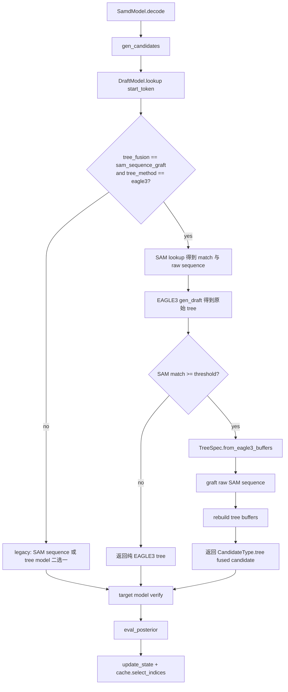

# sam-eagle3-tree-fusion design

## 0. 术语约定

| 术语 | 定义 | 防冲突结论 |
|---|---|---|
| tree fusion | 把来自多个 draft source 的候选 token 组织成同一棵验证树，让 target model 一次 forward 同时验证 | 仓库当前无同名实现；`samd` 现状是 SAM sequence 与 tree model 二选一 |
| SAM sequence graft | Stage A 策略：把 SAM 最长匹配生成的一条 sequence 当成一条分支接到 EAGLE3 tree root 后面 | 新概念；区别于 `samd_sam_only` 的 static SAM multi-branch tree |
| raw SAM sequence | 不含 padding 的 SAM draft 序列，形如 `[start_token, ...real_tokens]` | 当前 `samd/sam/*_sam.py:gen_draft` 会 padding 到 `n_predicts`，fusion 需新增不带 padding 的内部路径 |
| TreeSpec | fusion 内部树表示：`tokens + parents`，用于重建 `tree_attn_mask / tree_position_ids / tree_retrieve_indices` | 全新内部 helper，不作为公开 API |
| `tree_fusion` | 新增配置项，表示候选树组合策略；不同于 `tree_method` 的 draft model 类型 | 避免新增 `tree_method="eagle3_fusion"` 这种混合概念 |

## 1. 决策与约束

### 需求摘要

- **做什么**：在 `samd` 主路径新增 `tree_fusion="sam_sequence_graft"`，让 `tree_method="eagle3"` 时能保留完整 EAGLE3 tree，并在 SAM match 达阈值时把 raw SAM sequence graft 成额外分支，交给 target model 一次 forward 验证。
- **为谁**：做 SAM-Decoding + EAGLE3 组合实验的研究者，想验证 SAM 检索候选与 EAGLE3 draft tree 是否互补，并优先追求 accepted tokens / step 与 speedup。
- **成功标准**：
  1. 默认 `tree_fusion="none"` 时现有 EAGLE3 / SAMD 行为不变。
  2. `tree_method="eagle3", tree_fusion="sam_sequence_graft"` 且 SAM match 达阈值时，`DraftModel.lookup()` 返回 fused tree candidate。
  3. fused tree 的 `tree_attn_mask / tree_position_ids / tree_retrieve_indices` 可被现有 `SamdModel.decode()` 和 `eval_posterior()` 直接消费。
  4. greedy 输出仍与 base model greedy 一致。
  5. 能跑最小 ablation：pure EAGLE3、当前 SAMD+EAGLE3 二选一、SAM sequence graft fusion。
- **明确不做**：
  1. 不新增 `tree_method="eagle3_fusion"`。
  2. 不修改 EAGLE3 draft model 的核心 `topK_genrate()` 搜索策略。
  3. 不实现完整 SAM multi-branch tree fusion。
  4. 不做 EAGLE3 / SAM score-based pruning。
  5. 不压缩或裁剪 EAGLE3 tree；Stage A 性能优先，允许 fused tree 变大。
  6. 不改变 greedy decoding 输出语义。

### 复杂度档位

走研究/实验代码默认档位，无偏离。该 feature 是推理候选生成策略扩展，不涉及对外 SDK、高并发服务、持久化 schema 或 UI。

### 关键决策

**D1：新增 `tree_fusion` 配置，不新增 `tree_method="eagle3_fusion"`**

`tree_method` 继续表示 draft tree model 类型，`tree_fusion` 表示候选树组合策略：

```python
SamdConfig(
    tree_method="eagle3",
    tree_fusion="sam_sequence_graft",
)
```

被拒方案是新增 `tree_method="eagle3_fusion"`。那会把“模型类型”和“组合策略”混在同一个枚举里，也容易绕开 EAGLE3 现有 patch 路由与 hidden state 约束。

**D2：Stage A 只做 SAM sequence graft，Stage B 再做 SAM tree union + pruning**

第一版重点是快速回答“SAM 与 EAGLE3 候选是否互补”。因此先复用现有 SAM 最长匹配 sequence，不把 `samd_sam_only` 的 static SAM tree 搜索迁入主路径。Stage B 再复用 `samd_sam_only/sam/static_sam.py` 的 `cnt_endpos / states_topk_next / gen_buffers` 经验做完整 SAM tree fusion。

**D3：fusion 发生在 draft 编排层，不侵入 `Eagle3Model`**

`Eagle3Model` 只负责生成 EAGLE3 自身 tree；SAM dyn/static 实例在 `DraftModel` 持有，fusion 必须在能同时看到 SAM candidate 与 EAGLE3 candidate 的编排层完成。这样也能保留 `.codestable/compound/2026-05-24-learning-samd-eagle3-incremental-state-machine.md` 记录的 EAGLE3 增量状态机不变。

**D4：EAGLE3 tree 全保留，SAM branch 追加，第一版只做无损 prefix merge**

性能优先目标下，不裁剪 EAGLE3 节点。若 SAM sequence 与 EAGLE3 tree 有 shared prefix，则复用已有节点，只追加缺失 suffix；这是无损去重，不属于 score pruning。

**D5：SAM graft 必须使用 raw sequence，不能把 padding token 接入 tree**

当前 `samd/sam/dyn_sam.py` 与 `samd/sam/static_sam.py` 的 `gen_draft()` 会补 0 到 `n_predicts`。fusion 使用 raw sequence provider，只 graft 真实 token，避免 target model 验证 padding 0。

**D6：非 EAGLE3 开启 `sam_sequence_graft` 直接报错**

`tree_fusion="sam_sequence_graft"` 第一版只支持 `tree_method="eagle3"`。其他 tree method 直接 `ValueError`，避免实验时 silent 跑错组别。

### 前置依赖

无。

## 2. 名词与编排

### 2.1 名词层

#### 现状

- `samd/samd_config.py:SamdConfig` — 保存 `tree_method`、`len_threshold`、`len_bias`、`tree_config` 等推理配置；`__post_init__` 根据 `tree_method` 加载对应 tree config。
- `samd/draft.py:DraftModel.lookup` — 当前在 SAM 与 tree model 之间二选一：SAM match 达阈值返回 `CandidateType.sequence`，否则调 `self.tree_model.gen_draft(start_token)` 返回 `CandidateType.tree`。
- `samd/tree_model/eagle3/eagle3.py:Eagle3.gen_draft` — 调 `Eagle3Model.topK_genrate()`，返回 `pred_ids` 与 tree buffers。
- `samd/tree_model/eagle3/eagle3_model.py:Eagle3Model.topK_genrate` — EAGLE3 原生 top-k tree 搜索；返回 `draft_tokens / retrieve_indices / tree_mask / tree_position_ids`。
- `samd/utils.py:gen_candidates` — 把 sequence 或 tree draft 转成 `Candidates(type, tokens, candidate_tokens, buffers_kwargs)`；tree 路径依赖 `tree_retrieve_indices` 从 tree nodes 取 path。
- `samd_sam_only/sam/static_sam.py` — SAM-only 路径已有 static SAM tree 生成经验：`cnt_endpos`、`states_topk_next`、heap search、`gen_buffers()`。

#### 变化

新增 / 变更以下名词：

1. **`SamdConfig.tree_fusion`**

   内部配置项，默认 `"none"`：

   ```python
   tree_fusion: Literal["none", "sam_sequence_graft"] = "none"
   ```

   示例：

   ```python
   # 来源：samd/samd_config.py:SamdConfig
   SamdConfig(tree_method="eagle3", tree_fusion="sam_sequence_graft")
   ```

2. **`TreeSpec` 内部树表示**

   用 `tokens + parents` 表达一棵验证树，再统一导出 buffers：

   ```python
   # 来源：新增 samd/tree_model/fusion.py
   TreeSpec(
       tokens=[start_token, token_a, token_b],
       parents=[-1, 0, 1],
   )
   ```

   约定 node `0` 是 root / `start_token`，`parents[0] = -1`。该结构只用于 fusion 计算，不进入公开 API。

3. **raw SAM sequence provider**

   在 `DynSAM` / `StaticSAM` 增加不带 padding 的内部 sequence 生成路径，示意：

   ```python
   # 来源：samd/sam/dyn_sam.py / samd/sam/static_sam.py
   gen_draft_raw(index: int, start_token: int, max_len: int) -> List[int]
   ```

   返回 `[start_token, ...real_tokens]`，不补 0。原有 `gen_draft()` padding 行为保持不变。

4. **fused tree candidate**

   当 fusion 生效时，`DraftModel.lookup()` 返回 `CandidateType.tree`，即使 SAM 原本是一条 sequence。对 `SamdModel.decode()` 来说，它只看到标准 tree candidate。

### 2.2 编排层

#### 主流程图



#### 现状

当前拓扑是线性 pipeline + 二分支 router：

```text
sample_p -> start_token -> DraftModel.lookup
  -> SAM match 达阈值：CandidateType.sequence
  -> SAM match 不达阈值：CandidateType.tree from EAGLE3
  -> target model verify -> eval_posterior -> update_state
```

EAGLE3 路径还有独立增量状态机：`Eagle3` 维护 `cumulative_tokens` 与 `pending_hidden_states`，`Eagle3Model.stable_kv` 复用历史 KV。

#### 变化

开启 `tree_fusion="sam_sequence_graft"` 后，`DraftModel.lookup()` 的 EAGLE3 分支升级为“同时生成再融合”：

```text
start_token
  -> SAM lookup + raw sequence
  -> EAGLE3 gen_draft
  -> match 不足：返回 EAGLE3 tree
  -> match 达阈值：EAGLE3 tree + SAM branch -> fused tree
```

`SamdModel.decode()`、`gen_candidates()`、`eval_posterior()` 的接口不变。

#### 流程级约束

- **默认行为不变**：`tree_fusion="none"` 走 legacy 二选一。
- **fusion 只支持 EAGLE3**：`tree_fusion="sam_sequence_graft"` 且 `tree_method != "eagle3"` 时直接报错。
- **fusion 返回 tree candidate**：SAM graft 后统一走 `CandidateType.tree`。
- **EAGLE3 tree 全保留**：Stage A 不剪 EAGLE3 节点，只追加 SAM suffix 或复用 prefix。
- **不 graft padding**：raw SAM sequence 不包含 padding 0。
- **保持 EAGLE3 增量 invariant**：fusion step 仍调用 `Eagle3.gen_draft()` 消费 pending hidden states，不绕过 `stable_kv` 约定。
- **可观测性**：最小 ablation 至少保留 decode steps、accepted length per step、wall-time；若开启 diagnosis trace，仍遵守 trace OFF 测速 / trace ON 诊断分离约束。

### 2.3 挂载点清单

1. **配置挂载点：`SamdConfig.tree_fusion`** — 新增配置 key，默认 `"none"`；删掉该 key 后 fusion 能力在系统视角消失。
2. **推理 / 评测入口挂载点：`--tree_fusion`** — `samd/inference/cli.py` 与 `evaluation/inference_samd.py` 增加参数透传，便于跑 ablation。
3. **draft 编排挂载点：`DraftModel.lookup()`** — 在 legacy 二选一与 EAGLE3+SAM graft fusion 之间切换。

### 2.4 推进策略

1. **编排前置：配置与合法性骨架**
   - 退出信号：默认 `tree_fusion="none"` 保持现有路径；非 EAGLE3 开启 graft fusion 会明确报错。
2. **计算节点：TreeSpec / buffer builder**
   - 退出信号：手写小树能生成正确 `tree_attn_mask / tree_position_ids / tree_retrieve_indices`。
3. **计算节点：EAGLE3 tree 转 TreeSpec + round-trip**
   - 退出信号：EAGLE3 tree 转成 `TreeSpec` 再导出 buffers 后，retrieve paths 与原始 tree 等价。
4. **计算节点：raw SAM sequence provider**
   - 退出信号：raw sequence 不含 padding；legacy `gen_draft()` 行为不变。
5. **编排接入：DraftModel fusion branch**
   - 退出信号：SAM-hit 场景返回 `CandidateType.tree` fused candidate，且节点数相对纯 EAGLE3 合理增长或因 prefix merge 保持最小增长。
6. **入口与实验闭环：CLI / evaluation 参数 + 最小 ablation**
   - 退出信号：能用入口跑默认 EAGLE3、二选一 SAMD+EAGLE3、fusion 三组，并收集 accepted length / wall-time。

### 2.5 结构健康度与微重构

##### 评估

- 文件级 — `samd/draft.py`：当前职责是 draft 来源选择与状态更新；fusion 应挂在这里做 orchestration，但 tree 合并计算不应塞进该文件。
- 文件级 — `samd/utils.py`：当前负责 candidate tensor 化与 posterior eval；不应承载 fusion 逻辑，避免“候选生成”和“候选验证”混杂。
- 文件级 — `samd/tree_model/eagle3/eagle3_model.py`：EAGLE3 官方逻辑移植文件，职责是 EAGLE3 自身 top-k tree 搜索；不应侵入 SAM 逻辑。
- 目录级 — `samd/tree_model/`：已有多个 tree model 子包与 `tree.py`；新增轻量 `fusion.py` 能隔离组合逻辑，不需要移动已有目录。
- compound 检索 — 未命中与 fusion 模块归属冲突的目录组织 / 命名 convention；命中 EAGLE3 增量状态机 learning，已在流程约束中保留。

##### 结论：不做

本 feature 不做前置微重构。原因：现有挂载点职责清晰，fusion 计算可通过新增小模块隔离，不需要移动已有文件，也不需要改已有 public contract。

##### 超出范围的观察

- Stage B 若要完整复用 `samd_sam_only` 的 static SAM tree，需要考虑统一两套 SAM tree buffer 生成逻辑，并处理 `cnt_endpos / states_topk_next` 是否进入主 `samd` static SAM artifact。该工作涉及数据结构和 artifact 兼容性，建议后续单独 design，不阻塞 Stage A。

## 3. 验收契约

### 3.1 关键场景清单

1. **默认 EAGLE3 行为不变**
   - 输入 / 触发：`SamdConfig(tree_method="eagle3")` 或 `tree_fusion="none"`。
   - 期望：`DraftModel.lookup()` 仍按 legacy 二选一返回；现有 EAGLE3 回归测试 / 等价性检查不因新增 fusion 代码变化；greedy 输出与 base model greedy 一致。

2. **开启 fusion 但 SAM match 不足**
   - 输入 / 触发：`tree_method="eagle3", tree_fusion="sam_sequence_graft"`，当前 step 的 SAM match length 小于阈值。
   - 期望：返回 `CandidateType.tree` 的纯 EAGLE3 tree；buffers 与纯 EAGLE3 tree 等价；不追加 SAM branch。

3. **开启 fusion 且 SAM match 达阈值**
   - 输入 / 触发：`tree_method="eagle3", tree_fusion="sam_sequence_graft"`，dyn 或 static SAM match 达到阈值。
   - 期望：同时生成 EAGLE3 tree 与 raw SAM sequence；返回 `CandidateType.tree`；fused tree 包含完整 EAGLE3 tree 与 SAM branch 真实 token；现有 `SamdModel.decode()` 可消费。

4. **SAM branch 与 EAGLE3 tree 有 shared prefix**
   - 输入 / 触发：EAGLE3 tree 已含 `start -> a -> b`，SAM raw sequence 为 `start -> a -> b -> c -> d`。
   - 期望：复用 `start -> a -> b`，只新增 `c -> d`；`tree_retrieve_indices` 中存在完整路径；不出现同父同 token 重复节点。

5. **SAM raw sequence 不把 padding 0 接入 tree**
   - 输入 / 触发：legacy SAM `gen_draft()` 会返回 `[start, x, y, 0, 0]`。
   - 期望：fusion 只 graft `[start, x, y]`；fused tree 不因 padding 产生额外 token `0` 节点；legacy padding 行为不变。

6. **错误配置有明确行为**
   - 输入 / 触发：`SamdConfig(tree_method="eagle2", tree_fusion="sam_sequence_graft")`。
   - 期望：初始化或配置校验阶段直接 `ValueError`，提示该 fusion 仅支持 EAGLE3。

7. **最小 ablation 可跑**
   - 输入 / 触发：同一组 prompt / bench subset 跑 pure EAGLE3、当前 SAMD+EAGLE3 二选一、fusion 三组。
   - 期望：至少能收集 decode steps、accepted length per step、total decode tokens、wall-time、speedup ratio；fusion 组给出可对比证据。

### 3.2 明确不做的反向核对项

- 代码中不应出现新的 tree method 字符串 `"eagle3_fusion"`。
- `Eagle3Model.topK_genrate()` 不应引入 SAM 相关逻辑。
- Stage A 不应把 static SAM `cnt_endpos / states_topk_next` 接入主 `samd` 路径。
- 第一版不应根据 EAGLE3 score 或 SAM score 删除 EAGLE3 节点。
- 开启 fusion 后最终 greedy 输出必须仍与 base model greedy 一致。
- 不显式传 `tree_fusion` 时，现有测试和推理路径不应变化。

## 4. 与项目级架构文档的关系

验收阶段建议更新 `.codestable/architecture/ARCHITECTURE.md` 的 `samd/` 或 `samd/tree_model/` 小节，提炼以下系统级变化：

- `samd` 主路径不再只有 “SAM sequence vs tree model 二选一”；在 `tree_method="eagle3"` 且 `tree_fusion="sam_sequence_graft"` 时，draft candidate 可以由多个来源融合成同一棵验证树。
- fusion 层位于 `DraftModel` / tree model 输出组合层，不侵入 EAGLE3 内部模型。
- `tree_method` 表示 draft tree model 类型，`tree_fusion` 表示候选树组合策略；如果实现跑通并成为长期约定，建议后续走 `cs-decide` 归档。

不需要回写 architecture 的内容：`TreeSpec` helper 具体实现、prefix merge 代码写法、Stage A 临时 ablation 脚本细节、Stage B 未实现 pruning 策略。
