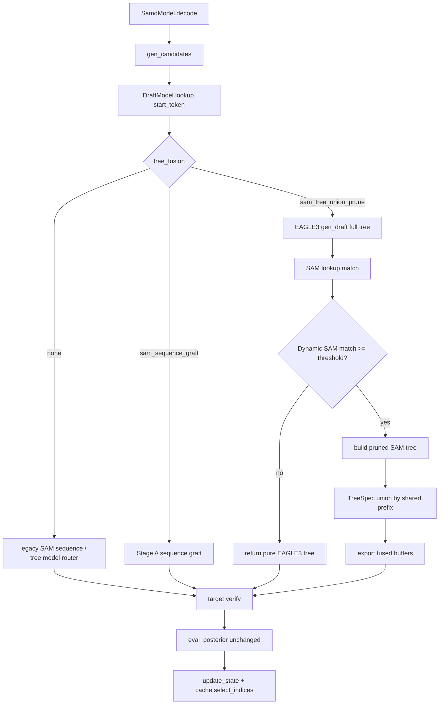

# sam-eagle3-tree-union-pruning design

## 0. 术语约定

| 术语 | 定义 | 防冲突结论 |
|---|---|---|
| Dynamic SAM tree | 从 `DynSAM` 当前在线匹配状态出发，沿 SAM 转移边展开的多分支候选树 | 区别于 Stage A 的单条 raw SAM sequence；不依赖离线 StaticSAM artifact |
| tree union | 把 EAGLE3 tree 与 SAM tree 归并成一棵 verifier tree，共享 root 与相同 prefix 节点 | 比 Stage A 的 `graft_sequence` 更一般，输入是两棵树而不是一条 sequence |
| pruning budget | 对新增 SAM 分支的节点上限 / 深度上限 / 每层分支上限，用于控制 fused tree 的 verifier forward 成本 | 第一版预算只约束 SAM side，不裁剪 EAGLE3 已生成 tree |
| SAM prior score | 从 Dynamic SAM 在线 endpos 频次或结构预算得到的路径排序依据，用于裁掉低价值 SAM 分支 | 不与 EAGLE3 logits score 做跨源直接比较 |
| `sam_tree_union_prune` | 新增 `tree_fusion` 策略名，表示 Stage B 的 SAM multi-branch tree union + SAM-side pruning | 不新增 `tree_method`，继续保持模型类型和融合策略分离 |

## 1. 决策与约束

### 需求摘要

- **做什么**：在 Stage A `sam_sequence_graft` 已验证有效的基础上，新增 `tree_fusion="sam_tree_union_prune"`，优先把 Dynamic SAM 当前在线状态形成的多分支树与 EAGLE3 tree 做 prefix union，并用 SAM 频次 / 深度 / 节点预算剪掉低价值 SAM 分支。
- **为谁**：做 SAM-Decoding + EAGLE3 组合实验的研究者，想验证“多条 SAM 候选分支”是否能比单条 SAM sequence graft 进一步提高 accepted tokens / step 与 throughput。
- **成功标准**：
  1. 默认 `tree_fusion="none"` 与 Stage A `sam_sequence_graft` 行为不变。
  2. `tree_fusion="sam_tree_union_prune"` 仅在 `tree_method="eagle3"` 时启用；第一版直接使用 `DynSAM`，不要求 Static SAM artifact。
  3. SAM tree 与 EAGLE3 tree union 后仍返回标准 `CandidateType.tree`，被现有 `SamdModel.decode()` / `eval_posterior()` 消费。
  4. EAGLE3 tree 在第一版中全保留；剪枝只作用于 SAM 新增分支。
  5. 最小实验在 MT-Bench / MedQuAD 上对比 pure EAGLE3、legacy SAMD+EAGLE3、Stage A sequence graft、Stage B union-prune。
  6. Stage B 相比 Stage A 的目标是 tokens/s 不下降，mean_accept 或 V_miss 至少一项改善；若 fused tree 变大导致速度下降，则按失败记录。
- **明确不做**：
  1. 不新增 `tree_method="eagle3_union"` 或类似混合枚举。
  2. 不侵入 `Eagle3Model.topK_genrate()` 的搜索策略。
  3. 第一版不做 EAGLE3 score 与 SAM prior score 的跨源归一化比较。
  4. 第一版不删除 EAGLE3 节点；EAGLE3 的内部 top-k tree 已是它自己的剪枝结果。
  5. 不改变 verifier / posterior 接受规则。
  6. 第一版不要求重建 Static SAM artifact，也不把 StaticSAM tree 能力作为阻塞依赖；StaticSAM 多分支树可作为后续扩展。

### 复杂度档位

走研究 / 实验代码默认档位，但有一个偏离点：这次不是单纯新增候选形态，而是引入“预算”控制 verifier tree 大小，因此所有剪枝参数必须能从 CLI / evaluation 入口显式记录，避免结果不可复现。

### 关键决策

**D1：Stage B 新增 `tree_fusion="sam_tree_union_prune"`，不替换 Stage A**

Stage A `sam_sequence_graft` 已有正向结果，是后续 ablation 的基线。Stage B 作为新的融合策略并行存在：

```python
SamdConfig(tree_method="eagle3", tree_fusion="sam_tree_union_prune")
```

这样可以在同一入口比较 `none` / `sam_sequence_graft` / `sam_tree_union_prune`，也便于失败时只关闭 Stage B。

**D2：第一版只做 SAM-side pruning，不跨源裁剪 EAGLE3**

EAGLE3 的节点排序来自 draft model logits，SAM 的节点排序来自 suffix frequency，两者不是同一概率空间。直接混合打分再裁剪可能把本来有用的 EAGLE3 分支删掉，导致结果不可解释。因此第一版保守处理：完整保留 EAGLE3 tree，只控制 SAM tree 的新增节点数和深度。

**D3：第一版直接用 Dynamic SAM，不以 StaticSAM artifact 为前置**

Stage A 的实际 fusion 命令未传 `--sam_path`，因此正向收益主要来自 `DynSAM` 的在线 sequence graft，而不是离线 StaticSAM。Stage B 第一版应顺着这条证据链，先把 `DynSAM` 从“给一条 sequence”扩展为“给一棵预算内 tree”。这避免了 StaticSAM artifact schema 兼容问题，也让最小实验更快闭环。

`samd_sam_only/sam/dyn_sam.py` 已有可参考的 `gen_tree_draft()` / `gen_buffers()`；主路径 `samd/sam/dyn_sam.py` 当前只支持 `gen_draft_raw()`。Stage B 迁入 tree draft 能力时，可以给 `DynSAM.SAMState` 增加在线 `cnt_endpos` 统计，或先使用结构预算做 BFS / top-K 展开。StaticSAM 的 `cnt_endpos / states_topk_next` 版本留作后续 Stage B1。

**D4：tree union 继续复用 / 扩展 `TreeSpec`**

Stage A 已有 `TreeSpec(tokens, parents)` 与 buffer builder。Stage B 不再新增另一套 tree buffer 生成器，而是在 `TreeSpec` 上增加“从 SAM tree / parents 构造”和“union / prune”能力，避免 SAM-only 与 main `samd` 两套 buffer 逻辑继续分叉。

**D5：预算优先级是安全可解释，而非一次到位最优**

默认剪枝顺序建议：Dynamic SAM 每层 top-K → 全局 SAM node budget → prefix union 去重。保留路径闭包：任何保留的叶子，其祖先必须全部保留。若 SAM tree 与 EAGLE3 shared prefix 重合，复用节点不计入新增预算或单独记录为 `merged_nodes`。

**D6：借鉴 `samd_sam_only` 的 tree 优化，但第一版只迁入最小可解释集合**

`samd_sam_only/sam/dyn_sam.py` 已有 `gen_tree_draft()`：按 `n = min(max_predicts, 1 + int(match_length * alpha))` 控制候选规模，并用 `anc_tree` 生成 tree buffers。`samd_sam_only/sam/static_sam.py` 进一步提供 `cnt_endpos`、`states_topk_next`、`SearchItem` heap search 和 per-depth `K` 限制。Stage B 第一版采用这些经验中的最小集合：

- 保留 `match_length * alpha` 的动态规模控制，但再叠加显式 `sam_tree_max_nodes / sam_tree_max_depth / sam_tree_top_k` budget。
- 给主路径 `DynSAM.SAMState` 增加在线 `cnt_endpos`，用于给当前状态的出边排序。
- 不维护全局 `states_topk_next` 缓存；Dynamic SAM 每步都在增量更新，第一版直接在查询时按 child `cnt_endpos` 排序并截断 top-K，避免缓存失效问题。
- 复用 `SearchItem` / heap + per-depth K 的思路做高频路径优先展开；若这一层排序带来开销，再退回 bounded BFS 做对照。
- 不复用 SAM-only 的 `gen_buffers()` 作为第二套 buffer builder；SAM tree 直接产出 `TreeSpec(tokens, parents)`，统一走 `TreeSpec.to_buffers()`。

### 实验假设

如果把 Stage A 的 Dynamic SAM 单条 sequence 扩展成预算内 multi-branch Dynamic SAM tree，那么在相同 verifier 规则下，MT-Bench / MedQuAD 的 mean accepted tokens 或 V_miss 应该优于 Stage A；如果新增分支带来的 verifier 成本过高，tokens/s 会下降并否定这一策略。

## 2. 名词与编排

### 2.1 名词层

#### 现状

- `samd/tree_model/fusion.py:TreeSpec` — 已能从 EAGLE3 buffers 恢复 tree、导出标准 tree buffers，并把单条 sequence graft 到 tree 上。
- `samd/draft.py:DraftModel.lookup` — Stage A 在 `tree_fusion="sam_sequence_graft"` 时先调用 EAGLE3 `gen_draft()`，SAM match 达阈值后 graft raw sequence。
- `samd/sam/dyn_sam.py:DynSAM` — 主路径 Dynamic SAM 当前以在线 `min_endpos` 支持 sequence lookup / raw sequence；每个 decode step 都随 accepted tokens 更新，不依赖离线 artifact。
- `samd_sam_only/sam/dyn_sam.py:DynSAM` — SAM-only 路径已有 `gen_tree_draft()` / `gen_buffers(anc_tree)` 经验，能从在线 SAM 状态展开多分支 tree，但排序与预算还比较简单。
- `samd/sam/static_sam.py:StaticSAM` — 主路径 StaticSAM 当前以 `min_endpos` 支持 sequence lookup / raw sequence，不保存 `cnt_endpos` 和 `states_topk_next`；Stage B 第一版不以它为前置。
- `samd/utils.py:gen_candidates` — tree draft 最终只要求 `tokens + tree_retrieve_indices`，不关心候选树来自 EAGLE3、SAM 还是 union。

#### 变化

1. **新增 tree fusion 策略**

   ```python
   tree_fusion: Literal["none", "sam_sequence_graft", "sam_tree_union_prune"]
   ```

   `sam_tree_union_prune` 与 Stage A 一样只支持 `tree_method="eagle3"`。

2. **SAM tree draft**

   Dynamic SAM 提供 tree 生成能力，概念接口：

   ```python
   gen_tree_draft(index: int, match_length: int, start_token: int, budget: SamTreeBudget) -> TreeSpec
   ```

   返回 root 为 `start_token` 的 SAM tree。内部候选第一版来自 Dynamic SAM 当前状态的转移边，可用在线 `cnt_endpos` 或结构预算排序；不读取 StaticSAM artifact。

   规模控制沿用 SAM-only 思路再加显式 budget：

   ```python
   target_nodes = min(
       budget.max_nodes,
       1 + int(match_length * budget.alpha),
   )
   ```

   每个状态展开时只取按 `cnt_endpos` 排序后的前 `budget.top_k` 条边，并受 `budget.max_depth` 约束。

3. **SAM tree budget**

   用配置描述 SAM side 的剪枝边界，示意字段：

   ```python
   sam_tree_max_nodes: int
   sam_tree_top_k: int
   sam_tree_alpha: float
   sam_tree_max_depth: Optional[int]
   ```

   这些值必须写入 CLI / evaluation 输出日志，便于复现实验。

4. **TreeSpec union / prune**

   `TreeSpec` 增加概念能力：

   ```python
   eagle_tree.union_sam_tree(sam_tree, sam_budget) -> fused_tree
   ```

   union 规则：root token 必须一致；同父同 token 复用已有节点；保留叶子路径闭包；最终导出标准 tree buffers。

### 2.2 编排层

#### 主流程图



#### 现状

Stage A 的 `DraftModel.lookup()` 已经能同时看到 SAM lookup 结果和 EAGLE3 draft tree，但 SAM 侧只拿一条 raw sequence。SAM-only 路径具备生成 SAM tree 的经验，但与 main `samd` 的 EAGLE3 / hidden-state 增量状态机分离。

#### 变化

开启 `tree_fusion="sam_tree_union_prune"` 后：

```text
start_token
  -> EAGLE3 gen_draft 得到完整 EAGLE3 tree
  -> SAM lookup 判断 match
  -> Dynamic SAM match 不足：返回纯 EAGLE3
  -> Dynamic SAM match 达阈值：DynSAM 生成预算内 SAM tree
  -> EAGLE3 TreeSpec union SAM TreeSpec
  -> 返回 CandidateType.tree fused candidate
```

`SamdModel.decode()`、`gen_candidates()`、`eval_posterior()` 保持接口不变。

#### 流程级约束

- **EAGLE3 状态机不绕过**：Stage B 仍必须每步先调用 `Eagle3.gen_draft()`，消费 pending hidden states。
- **EAGLE3 tree 第一版全保留**：SAM pruning 不能删除 EAGLE3 节点。
- **SAM tree 必须路径闭包**：保留任意叶子时必须保留 root 到叶子的所有祖先。
- **shared prefix 去重**：union 后不能出现同父同 token 重复节点。
- **预算可观测**：每次实验记录 SAM tree budget、fused node count、SAM added nodes、merged nodes。
- **不依赖 StaticSAM artifact**：第一版 Stage B 即使 `--sam_path` 未传也应可运行；StaticSAM tree source 若后续加入，必须作为显式扩展而非隐式改变。
- **trace 分离**：继续遵守 p1 trace OFF 测速、p2 trace ON 诊断。

### 2.3 挂载点清单

1. **配置挂载点：`SamdConfig.tree_fusion="sam_tree_union_prune"` 与 SAM tree budget** — 删掉这些配置后 Stage B 能力消失。
2. **Dynamic SAM tree draft 挂载点** — `DynSAM.gen_tree_draft` / 在线 `cnt_endpos` 或结构预算是第一版 SAM tree 的生成来源。
3. **TreeSpec union / pruning 挂载点** — 负责把两棵树变成标准 verifier tree；删掉后只能回到 Stage A sequence graft。
4. **DraftModel lookup 编排挂载点** — 在现有 `none` / `sam_sequence_graft` 之外路由到 Stage B。
5. **评测入口参数挂载点** — CLI / evaluation 需要透传 `tree_fusion` 与 budget 参数，保证 ablation 可复现。

### 2.4 推进策略

1. **配置骨架：新增 Stage B fusion 策略与 budget 配置**
   - 退出信号：默认行为与 Stage A 不变；非法 tree_method / 缺 budget 类型能明确报错。
2. **计算节点：让主路径 DynSAM 支持在线 cnt_endpos 与 tree draft metadata**
   - 退出信号：DynSAM 更新 token 时维护 `cnt_endpos`；能从当前在线状态生成 root 为 start_token 的多分支 tree；无需 `--sam_path` 也能工作。
3. **计算节点：实现 SAM tree draft + SAM-side pruning**
   - 退出信号：给定手写 SAM 状态与 budget，生成的 SAM tree 节点数 / 深度 / 每层分支满足预算且路径闭包成立；child 排序遵守在线 `cnt_endpos`。
4. **计算节点：实现 TreeSpec union**
   - 退出信号：EAGLE3 小树 + SAM 小树 union 后复用 shared prefix，不出现同父同 token 重复节点，buffers 可 round-trip。
5. **编排接入：DraftModel lookup Stage B branch**
   - 退出信号：SAM match 不足返回纯 EAGLE3；match 达阈值返回 union-pruned tree；EAGLE3 pending hidden states 正常消费。
6. **可观测性：记录 fused tree size 与 budget 命中情况**
   - 退出信号：p1 / p2 answer 或 stdout 中可看到 node_count、sam_added_nodes、merged_nodes、budget 参数。
7. **实验闭环：跑最小 Stage B ablation**
   - 退出信号：MT-Bench / MedQuAD 至少完成 Stage A vs Stage B 的 p1 speed 与 p2 V_miss 对比。

### 2.5 结构健康度与微重构

##### 评估

- 文件级 — `samd/draft.py`：Stage A 已增加一个 fusion branch；Stage B 再加复杂 tree union 和预算逻辑会让该文件从“编排”滑向“计算”。Stage B 只能在这里放路由，不应写 heap search / pruning 细节。
- 文件级 — `samd/tree_model/fusion.py`：当前 `TreeSpec` 文件轻量，适合承载通用 union / buffer builder；但不要把 Dynamic SAM 状态遍历全部塞进去。
- 文件级 — `samd/sam/dyn_sam.py`：当前主路径 DynSAM 与 SAM-only DynSAM 功能分叉。Stage B 需要在这里补 tree draft 入口或新增邻近 helper，避免继续依赖 `samd_sam_only` 的平行实现。
- 目录级 — `samd/sam/`：已有 dyn/static SAM；新增 SAM tree draft helper 放在此处比放 `tree_model/` 更合理，因为它依赖 SAM 状态结构。
- 目录级 — `samd/tree_model/`：保留跨来源 tree union 工具；不应反向依赖 StaticSAM 内部状态。
- compound 检索 — 命中 EAGLE3 增量状态机 learning、trace 分阶段约束与 tree_fusion 分层约束；本方案保持这些边界。

##### 结论：做小型职责拆分

Stage B 实现前建议做一个安全拆分：

- `samd/tree_model/fusion.py` 保留通用 `TreeSpec`、union 与 buffer 导出。
- 新增 `samd/sam/tree_draft.py`（或同等命名）承载 `SearchItem`、SAM tree budget、SAM tree heap search。
- `samd/sam/dyn_sam.py` 只暴露 tree draft 调用入口和必要在线统计，不承载全部 pruning 计算。
- `samd/draft.py` 只做三种 `tree_fusion` 策略的编排路由。

该拆分属于“新逻辑放新文件”，不是行为性重构；不要求移动旧代码。StaticSAM 多分支树若后续加入，应作为显式 Stage B1 扩展另行记录兼容策略。

##### 超出范围的观察

- 真正跨源 score pruning（SAM prior 与 EAGLE3 logits score 统一排序）需要校准和额外 ablation，建议在 Stage B1 结果后另起设计，不混入第一版。

## 3. 验收契约

### 3.1 关键场景清单

1. **默认 / Stage A 行为不变**
   - 输入 / 触发：`tree_fusion="none"` 或 `tree_fusion="sam_sequence_graft"`。
   - 期望：路径和 Stage A acceptance 记录一致，不因 Stage B 代码变化改变。

2. **未传 StaticSAM artifact 也可运行**
   - 输入 / 触发：`tree_fusion="sam_tree_union_prune"`，评测入口不传 `--sam_path`，只有在线 DynSAM 可用。
   - 期望：Stage B 仍使用 DynSAM tree source 正常运行；不得要求重建 StaticSAM artifact，也不得 silent 改回 Stage A sequence graft。

3. **SAM match 不足**
   - 输入 / 触发：fusion 策略为 Stage B，但当前 step 的 SAM match 低于阈值。
   - 期望：返回纯 EAGLE3 tree；不生成 SAM tree；EAGLE3 状态机正常推进。

4. **SAM match 达阈值且预算足够**
   - 输入 / 触发：EAGLE3 tree 包含 `start -> a`，SAM tree 包含 `start -> a -> b` 与 `start -> c`。
   - 期望：union 复用 `start -> a`，新增 `b` / `c`，最终 `tree_retrieve_indices` 包含对应叶子路径。

5. **SAM tree 超预算**
   - 输入 / 触发：SAM tree 展开超过 `sam_tree_max_nodes` 或 per-depth top-K。
   - 期望：低 `cnt_endpos` prior 分支被剪掉；保留路径闭包；最终新增 SAM nodes 不超过预算。

6. **shared prefix 去重**
   - 输入 / 触发：SAM tree 多条路径与 EAGLE3 tree 有相同 parent-token prefix。
   - 期望：同父同 token 只保留一个节点，`merged_nodes` 指标大于 0。

7. **最小 ablation 可跑**
   - 输入 / 触发：同一 bench subset 跑 Stage A fusion 与 Stage B union-prune。
   - 期望：收集 mean_accept、tokens/s、speedup、tree_steps、V_miss、node_count；若 Stage B tokens/s 下降则记录失败而不是只看 accept length。

### 3.2 明确不做的反向核对项

- 不新增 `tree_method="eagle3_union"` / `"eagle3_prune"`。
- 不修改 `Eagle3Model.topK_genrate()` 的搜索逻辑。
- 不删除 EAGLE3 tree 节点。
- 不直接比较 SAM prior score 与 EAGLE3 score 后做全局裁剪。
- 不改变 `eval_posterior()` / verifier 接受规则。
- 不把缺 `--sam_path` 当成 Stage B 不可运行条件；第一版不依赖 StaticSAM tree metadata。

## 4. 与项目级架构文档的关系

验收阶段若实现通过，建议更新 `.codestable/architecture/ARCHITECTURE.md`：

- `samd/sam/` 下 DynSAM 具备在线 multi-branch SAM tree draft 能力。
- `samd/tree_model/fusion.py` 从 Stage A sequence graft 扩展为通用 tree union / buffer builder。
- `tree_fusion` 策略从 `none / sam_sequence_graft` 扩展为 `none / sam_sequence_graft / sam_tree_union_prune`。
- 记录第一版剪枝边界：只做 SAM-side pruning，不裁剪 EAGLE3 tree。
