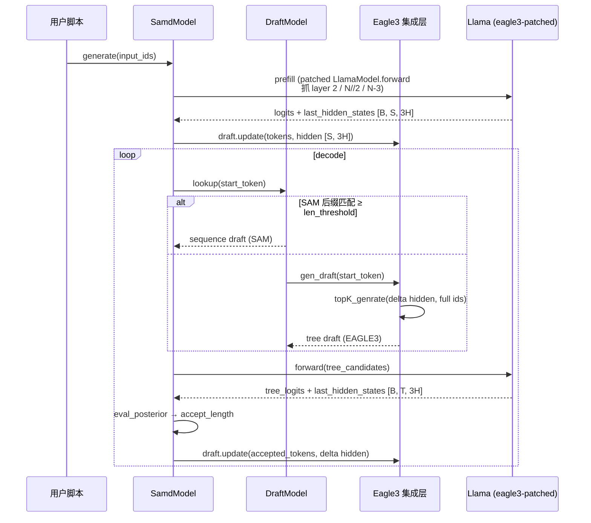

# 使用 EAGLE3 权重跑 SAM-Decoding

## 概述

SAM-Decoding 通过 `samd_config.tree_method` 路由不同 draft model 实现。`tree_method="eagle3"` 路径接入 EAGLE-3 训练的 draft 权重，与 EAGLE / EAGLE2 / Token Recycle 并列独立切换。EAGLE3 与 EAGLE2 比，draft 模型用 `fc(3H→H)` 投影（拼接 base 模型 low/mid/high 三层 hidden state）+ 独立 `lm_head` + d2t/t2d 词表映射 buffer —— 这些差异由本路径在加载、前向、采样三处分别处理，使用者只需准备权重 + 跑脚本。

混合模式（SAM[EAGLE3]）：DynSAM 始终启用，从 prompt + 历史 generated tokens 在线累积后缀；当后缀匹配长度 ≥ `len_threshold=5` 时走 SAM 序列路径，否则走 EAGLE3 树路径，由 `samd/draft.py:DraftModel.lookup` 自动切换。

## 前置依赖

| 项 | 要求 |
|---|---|
| Python / PyTorch | 按 README 实验环境（PyTorch 2.3.0、CUDA 12.1） |
| transformers | **必须 4.46.x**。新版（4.50+）API 不兼容（详见 `.trellis/spec/backend/runtime-constraints.md`） |
| safetensors | 安装；EAGLE3 官方权重优先 safetensors 格式 |
| Base model | Llama 系列 `LlamaForCausalLM`（Qwen / Mixtral 暂不支持） |
| EAGLE3 权重 | SafeAILab 发布的 EAGLE3 checkpoint 目录，含 `config.json` + `model.safetensors`（或 `pytorch_model.bin`） |
| GPU | 单 GPU。`SamdModel` 内 `batch_size=1` 限制 |

`samd` 模块本身导入即依赖 torch / transformers / safetensors，缺一个会在 `samd/__init__.py:1` 立即 `ImportError`。

## 数据流（混合模式下一次 decode step）



## 快速上手 — 单 prompt 验证跑通

仓库自带 `scripts/test_samd_eagle3.sh`：

```bash
# 编辑路径
vim scripts/test_samd_eagle3.sh
# 改 --model_path / --tree_model_path 为你的本地权重路径

bash scripts/test_samd_eagle3.sh
```

期望输出包含：

```
load eagle3 model from ...
eagle3 load: missing_keys=['embed_tokens.weight'], unexpected_keys=[], ...
setattr root -> forward
attn setattr root.model -> _update_causal_mask
attn setattr root.model -> forward
samd_model response: '<|begin_of_text|>...'
decode_steps: N, decode_tokens: 512
accepect_length_per_step: [...]
```

**`missing_keys=['embed_tokens.weight']` 是预期行为**（不是 bug）—— EAGLE3 官方权重不含此字段，集成层从 base model 复制兜底。

## 跑 benchmark

`scripts/inference_samd_eagle3.sh` 走 `evaluation/inference_samd.py`，支持 Spec-Bench 兼容格式的 benchmark：

```bash
# 默认 --bench-name spec_bench；改成你的数据集名
bash scripts/inference_samd_eagle3.sh
```

输出落到 `evaluation/data/{bench_name}/model_answer/{model_id}.jsonl`，每行含：`question_id` / `category` / `choices`（含 `decoding_steps` / `new_tokens` / `wall_time` / `accept_lengths` 子字段，可用于后续算加速比）。

## 自定义垂直数据集

evaluation 不需要改 Python 代码 —— 完全数据驱动。把数据按 Spec-Bench 格式放进去：

```
evaluation/data/{your_bench_name}/
└── question.jsonl
```

`question.jsonl` 每行一个 JSON 对象，最少字段：

```json
{"question_id": 1, "category": "vertical_cat", "turns": ["第一轮 user 问题", "第二轮 user 问题（可选）"]}
```

字段约定：

| 字段 | 类型 | 说明 |
|---|---|---|
| `question_id` | int / str | 每条唯一，用于 dedup 和 reorg |
| `category` | str | 类别标签，写答案时一起 dump 出来，便于按类别分析加速比 |
| `turns` | List[str] | 多轮对话每轮 user message；评估用 `tokenizer.apply_chat_template` 自动拼 system/user/assistant 标签，只填 user 内容 |

从已有数据集转换示例：

```python
import json
with open("evaluation/data/your_vertical/question.jsonl", "w") as f:
    for i, row in enumerate(your_dataset):
        f.write(json.dumps({
            "question_id": i,
            "category": row.get("category", "vertical"),
            "turns": [row["question"]],
        }, ensure_ascii=False) + "\n")
```

跑你的数据集：

```bash
# 编辑 scripts/inference_samd_eagle3.sh
--bench-name your_vertical \
```

## 与 base greedy 对照验证

speculative decoding 的正确性金标准 —— 输出应与 base model `do_sample=False` 逐 token 一致：

```bash
bash scripts/check_eagle3_equiv.sh
```

脚本会：
1. 先跑 `base_model.generate(do_sample=False, max_new_tokens=64)` 拿 token 序列
2. 然后装上 samd 包装跑 `samd_model.generate(...)`（**顺序重要 —— samd 的 monkey patch 改写 model 实例方法，必须先跑 base**）
3. 同 prompt 同 max_new_tokens 逐 token 对照

期望输出末尾：

```
S2 PASSED — eagle3 path matches base greedy on this prompt.
```

如果 FAIL，差异通常在前几个 token 内可见 —— 脚本会打印 first mismatch index + 两边 decode 结果。

## 接口参考

主入口 `SamdConfig`（`samd/samd_config.py`）：

| 字段 | EAGLE3 path 取值 | 说明 |
|---|---|---|
| `tree_method` | `"eagle3"` | 必填，路由 |
| `tree_model_path` | EAGLE3 权重目录 | 含 config.json + safetensors / bin |
| `eagle3_total_token` / `eagle3_depth` / `eagle3_top_k` | `60` / `7` / `10` | EAGLE3 tree 生成预算；这组值对齐官方 tail eval |
| `n_predicts` | 默认 40 | SAM 序列路径长度上限 |
| `len_threshold` | 默认 5 | SAM 匹配长度阈值；≥ 该值才走 sequence 路径 |
| `len_bias` | 默认 5 | StaticSAM 匹配长度的减项（让 DynSAM 优先于 StaticSAM） |

`SamdGenerationConfig`（`samd/utils.py`）：

| 字段 | 默认 | 说明 |
|---|---|---|
| `max_new_tokens` | 512 | 生成上限 |
| `max_cache_len` | 2048 | KV cache 长度上限 |
| `greedy` | True | 与 base do_sample=False 对齐用 |
| `temperature` | 0.0 | greedy 模式下不生效 |

## 常见踩坑

| 现象 | 根因 | 处理 |
|---|---|---|
| `ImportError: cannot import name 'StaticCache' from 'transformers.models.llama.modeling_llama'` | transformers 版本 4.50+ —— `StaticCache` 被移到 `cache_utils` | `pip install 'transformers==4.46.1'` |
| `ValueError: Asking to pad but the tokenizer does not have a padding token` | Llama-3 系列 tokenizer 默认 `pad_token=None`，`tests/test_samd.py:113` 用了 `padding=True` | 仓库已加 `if tokenizer.pad_token is None: tokenizer.pad_token = tokenizer.eos_token` 兜底；如自己写新入口注意保留 |
| `IndexError: too many indices for tensor of dimension 1` 在 `LlamaRotaryEmbedding.forward` | 早期实现 `tree_position_ids` 是 1-D；新版要 2-D `[1, T]` | 仓库已修；如基于本路径扩展新 tree_method，topK_genrate 末尾记得 `tree_position_ids[None]` |
| `accept_length` 远低于预期（如 < 3） | 大概率是 SAM-Decoding 与 EAGLE3 增量约定不匹配（持久状态 vs 累积状态错位） | 详见 `.trellis/spec/backend/eagle3-integration.md` 的 incremental state machine |
| 加载日志显示 `missing_keys=['embed_tokens.weight']` | 预期行为，非错误 —— EAGLE3 官方权重不含此字段，集成层从 base 复制兜底 | 忽略 |
| Vicuna 预构建的 SAM .pkl 喂给 Llama-3.1 base | tokenizer 词表完全不同，命中率约等于 0 | 用 Llama-3.1 重建 SAM，跑 `tools/prepare_prompts.py` → `tools/gen_response.py` → `tools/gen_sam_alpaca.py` 三步流水（README 详述）；或直接 `--sam_path None` 走纯 EAGLE3 + DynSAM |

## 已知限制

- 仅支持 Llama 系列 backbone（Qwen2/Qwen3/Mixtral 等不支持）—— 现有 patch 只覆盖 `LlamaForCausalLM` / `LlamaModel`
- `SamdModel` 仅支持 `batch_size=1`（`samd/samd_model.py:240` 显式 assert）
- Base 和 draft 的 `vocab_size` 不一致时 `Eagle3.__init__` 会跳过 embed_tokens 复制并警告 —— 仍能构造但 draft 推理无意义；强烈建议二者匹配
- transformers 升级到 4.50+ 需要重写 `samd/model_patch/llama.py` 和 `samd/model_patch/llama_eagle3.py`，目前没有自动适配机制

## 相关文档

- 架构与约束：`.trellis/spec/backend/project-architecture.md`
- 运行环境：`.trellis/spec/backend/runtime-constraints.md`
- EAGLE3 实施契约：`.trellis/spec/backend/eagle3-integration.md`
- 评测协议：`.trellis/spec/backend/evaluation-protocols.md`
- 迁移映射：`.trellis/tasks/06-05-codestable-to-trellis/research/codestable-inventory.md`
- EAGLE-3 论文：arXiv:2503.01840
- 官方实现：`SafeAILab/EAGLE` github main branch
